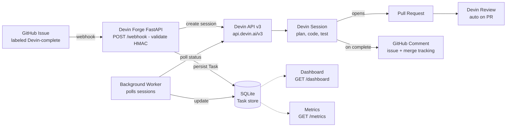

# Devin Forge — The AI Engineer That Delivers

A production-ready automation service that turns **GitHub Issues into merged Pull Requests** using [Devin](https://devin.ai), Cognition's autonomous AI software engineer. Label an issue, and the system dispatches Devin to implement the fix, run the tests, open a PR, review it, and report back on the issue — with full lifecycle tracking, metrics, and an operations dashboard.

Built for engineering teams evaluating autonomous software engineering workflows.

---

## Project Overview

When a GitHub Issue is labeled `Devin-complete` in a configured repository (e.g. [`jan21deepak/superset`](https://github.com/jan21deepak/superset)), this service:

1. Receives the webhook and validates its HMAC signature.
2. Persists a **Task** record in SQLite.
3. Creates a **Devin session** with a high-quality, scoped prompt.
4. Polls the Devin API every 20 seconds in a background worker.
5. On completion, stores the **pull request URL, summary, and runtime**, tracks **Devin Review**, and posts a ✅ comment back on the original issue.
6. Exposes a live **dashboard**, a **metrics endpoint**, and an orchestration-grade **health endpoint**.

## Architecture




Source: [`docs/architecture.mmd`](docs/architecture.mmd). To regenerate the PNG:

```bash
npx -p @mermaid-js/mermaid-cli mmdc \
  -i docs/architecture.mmd \
  -o docs/architecture.png \
  -b "#0b1220" -w 1500 -s 1
```

## Technology Stack

| Layer | Technology |
|---|---|
| Language | Python 3.12 |
| Web framework | FastAPI + Uvicorn |
| Persistence | SQLite + SQLAlchemy 2.x |
| Background worker | asyncio task (in-process, 20s poll loop) |
| HTTP client | httpx (async) |
| Config | pydantic-settings + python-dotenv |
| UI | Jinja2 + Bootstrap 5 |
| Container | Docker + Docker Compose |
| Tests | pytest + respx |

---

## Clone and replicate this setup

Follow these steps on any machine (macOS/Linux) to run the same stack end-to-end.

### Prerequisites

Install before you start:

| Tool | Why |
|---|---|
| [Git](https://git-scm.com/) | Clone the repo |
| [Python 3.12+](https://www.python.org/downloads/) | Runtime |
| [Docker Desktop](https://www.docker.com/products/docker-desktop/) *(optional)* | One-command container run |
| [GitHub CLI `gh`](https://cli.github.com/) *(recommended)* | Create webhooks / test issues |
| [ngrok](https://ngrok.com/) or [cloudflared](https://developers.cloudflare.com/cloudflare-one/connections/connect-apps/) | Expose `localhost:8000` so GitHub can reach `/webhook` |

You will also need:

1. A **GitHub personal access token** with permission to read repos, write issues/comments, and merge PRs on the target repository.
2. A **Devin service-user API key** (`cog_…`) and your **organization ID** (`org-…`) from Devin → Settings → Service Users.
3. A **webhook secret** string of your choosing (any long random value).

### 1. Clone the repository

```bash
git clone https://github.com/jan21deepak/devin-ai-engineer.git
cd devin-ai-engineer
```

### 2. Configure environment variables

```bash
cp .env.example .env
```

Edit `.env` and fill in at least:

```bash
GITHUB_WEBHOOK_SECRET=some-long-random-secret
GITHUB_TOKEN=<your-github-pat>
DEVIN_API_KEY=<your-devin-service-user-key>
DEVIN_ORG_ID=<your-org-id>
TRIGGER_LABEL=Devin-complete
```

Optional ROI knobs (dashboard Time-to-Dollar Savings) are documented in `.env.example`.

**Session attribution.** A `cog_` service-user key has no human identity, so Devin
stamps every session it creates with the `bot_apk` pseudo-user — which surfaces as an
unknown user in the Devin UI and audit logs. Set `DEVIN_CREATE_AS_USER_ID` to your
Devin user ID (Settings → Members, prefix `user-`) to have sessions created on behalf
of a real member instead. This needs the service user to hold `ImpersonateOrgSessions`
and the target user to be an org member with `UseDevinSessions`. Verify your
credentials and see which identity they resolve to with:

```bash
curl -s -H "Authorization: Bearer $DEVIN_API_KEY" https://api.devin.ai/v3/self
```

### 3. Run the service

**Option A — Docker (recommended for a clean replicate)**

```bash
docker compose up --build
```

This starts FastAPI on **http://localhost:8000**, initializes SQLite at `/data/tasks.db` inside the container, and persists it in the `devin_data` volume.

**Option B — Local Python**

```bash
python3.12 -m venv .venv
source .venv/bin/activate          # Windows: .venv\Scripts\activate
pip install -r requirements.txt
# If your network uses a corporate PyPI proxy, pass --index-url <proxy>/simple

mkdir -p data
.venv/bin/uvicorn app.app:app --host 0.0.0.0 --port 8000
```

In another terminal (with the venv activated):

```bash
pytest -q
```

### 4. Verify the app is healthy

```bash
curl -s http://localhost:8000/health | python3 -m json.tool
curl -s http://localhost:8000/metrics | python3 -m json.tool
open http://localhost:8000/dashboard   # or visit in a browser
```

Healthy response looks like:

```json
{
  "status": "healthy",
  "application": "ok",
  "checks": { "database": "ok", "github": "ok", "devin": "ok" }
}
```

If `github` or `devin` show as unreachable/unconfigured, the app still serves traffic (`degraded`) — fix the tokens in `.env` and restart.

### 5. Expose a public webhook URL

GitHub cannot call `localhost`. Tunnel it:

```bash
# ngrok
ngrok http 8000
# → copy the https://….ngrok-free.app URL

# or cloudflared
cloudflared tunnel --url http://localhost:8000
```

### 6. Point a GitHub webhook at your tunnel

Replace `<owner>/<repo>` with the repository you want Devin to work on, and `<public-host>` with the tunnel host from step 5:

```bash
gh auth login   # if needed — use the same account that owns the repo

gh api repos/<owner>/<repo>/hooks -f name=web \
  -F "config[url]=https://<public-host>/webhook" \
  -F "config[content_type]=json" \
  -F "config[secret]=$GITHUB_WEBHOOK_SECRET" \
  -F "events[]=issues" \
  -F active=true
```

Or in the GitHub UI: **Settings → Webhooks → Add webhook**

- Payload URL: `https://<public-host>/webhook`
- Content type: `application/json`
- Secret: same value as `GITHUB_WEBHOOK_SECRET`
- Events: **Issues** only

> Free ngrok/cloudflared URLs change on restart. Patch the hook:
>
> ```bash
> gh api -X PATCH repos/<owner>/<repo>/hooks/<hook_id> \
>   -F "config[url]=https://<new-host>/webhook" \
>   -F "config[content_type]=json" \
>   -F "config[secret]=$GITHUB_WEBHOOK_SECRET"
> ```

### 7. Register the repo in the dashboard and trigger Devin

1. Open **http://localhost:8000/dashboard** → **Repositories** tab.
2. Paste `https://github.com/<owner>/<repo>` and click **Add repository**.
3. Click **Add Issues** (imports open issues from a parent fork when applicable) or **Sync**.
4. On the **Issues** tab, select issues → **Assign to Devin**.

**Or trigger via the webhook label:**

```bash
# Create the label once
gh label create Devin-complete --repo <owner>/<repo> \
  --color 0E8A16 --description "Trigger Devin Forge automation" || true

# Open / label an issue
gh issue create --repo <owner>/<repo> \
  --title "Fix: example bug" \
  --body "Describe the change." \
  --label Devin-complete
```

### 8. Watch the result

- **Dashboard** tab: fix + review stats, engineering KPIs, daily activity chart (times in **SGT**).
- Original GitHub issue: ✅ completion comment with session ID, PR URL, runtime, summary.
- Devin opens a PR; Devin Review is tracked automatically; merge state is refreshed from GitHub.

---

## How It Works

### GitHub Webhook Flow

1. GitHub delivers an `issues` event to `POST /webhook`.
2. The service verifies `X-Hub-Signature-256` with the shared secret (constant-time HMAC compare). Invalid → **401**.
3. Non-issue events are acknowledged and ignored (**200**).
4. Trigger rule: issue `opened` with the `Devin-complete` label, or the `Devin-complete` label being added (`labeled`). Anything else is ignored.
5. Duplicate protection: an active or completed task for the same repo + issue is not recreated.
6. A `Task` row is written to SQLite, and a Devin session is created (**202**).

### Devin Workflow

The session prompt includes the repository URL, issue title, and issue body, and instructs Devin to:

- make only the requested changes,
- run the project's test suite,
- fix any failures introduced,
- create a pull request,
- summarize the completed work.

The background worker polls every 20 seconds, maps Devin session status to `queued → running → completed/failed`, recovers sessions that later open a PR after inactivity, tracks Devin Review, and on success posts a comment to the issue containing the session ID, PR URL, runtime and summary.

## Environment Variables

| Variable | Description | Default |
|---|---|---|
| `GITHUB_WEBHOOK_SECRET` | Shared secret for webhook HMAC validation | — |
| `GITHUB_TOKEN` | PAT used to post comments / merge PRs | — |
| `DEVIN_API_KEY` | Devin service-user key (`cog_…`) | — |
| `DEVIN_API_BASE` | Devin API base URL | `https://api.devin.ai/v3` |
| `DEVIN_ORG_ID` | Devin organization ID (`org-…`) | — |
| `DEVIN_CREATE_AS_USER_ID` | Devin user (`user-…`) to attribute sessions to; blank leaves them on the service user | — |
| `DEVIN_SESSION_TAG` | Tag applied to every session this app creates | `devin-forge` |
| `DATABASE_URL` | SQLAlchemy URL | `sqlite:///./data/tasks.db` |
| `POLL_INTERVAL_SECONDS` | Worker poll interval | `20` |
| `TRIGGER_LABEL` | Issue label that triggers automation | `Devin-complete` |
| `LOG_LEVEL` | Logging level | `INFO` |
| `JUNIOR_SWE_ANNUAL_COST_USD` | Assumed junior SWE fully-loaded cost | `150000` |
| `JUNIOR_HOURS_PER_ISSUE` | Hours a junior would spend per fix | `4.0` |
| `JUNIOR_HOURS_PER_REVIEW` | Hours a junior would spend per review | `1.0` |
| `DEVIN_ACU_USD` | USD per Devin ACU | `2.25` |

Time-to-Dollar Savings divides annual cost by **1,920** working hours/year. The service boots without API keys, logs warnings, and reports `degraded` on `/health`.

## Dashboard

`GET /dashboard` — neon dark UI, auto-refreshes every 15 seconds while the Dashboard tab is active:

- Repositories / Issues / Dashboard tabs
- Fix + Review time stats (active Devin work only; idle waits excluded)
- Engineering KPIs (avg PR cycle time, PRs delivered, merge rate, change failure rate)
- Daily activity bar chart (last 14 days, SGT)
- Recent activity with Devin Session / Devin Review deep links

## Metrics Endpoint

`GET /metrics` — computed live from SQLite (fix/review buckets, engineering KPIs, daily series, ROI assumptions).

## Health Endpoint

`GET /health` — suitable for orchestration platforms (Kubernetes, ECS, Docker healthchecks):

```json
{
  "status": "healthy",
  "application": "ok",
  "checks": { "database": "ok", "github": "ok", "devin": "ok" }
}
```

- **200** — `healthy`, or `degraded` (external API unreachable/unconfigured; app still serves traffic)
- **503** — `unhealthy` (database unreachable)

## Observability

Structured single-line logs with ISO-8601 **SGT** timestamps and key=value context, covering: webhook received, Devin session created, polling started/completed, task status changes, task completed/failed, GitHub comment posted, and database updates.

```
2026-08-03T11:30:00.123+08:00 | INFO | app.worker | task.completed | task_id=7 session_id=… pr=https://github.com/… runtime_seconds=734
```

## Future Improvements

- **Queue-based dispatch** (Celery / Redis) for horizontal scaling beyond the in-process worker
- **Postgres** backend for multi-replica deployments
- **Devin webhook callbacks** instead of polling, when available
- **Slack / Teams notifications** on task completion
- **Auth (OIDC)** on the dashboard and metrics endpoints
- **Multi-repo configuration** with per-repo trigger labels and prompt templates
