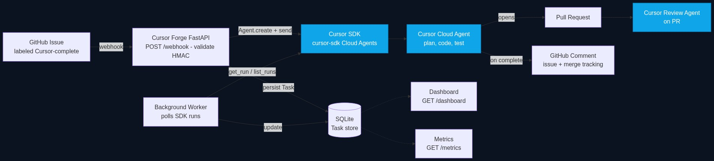
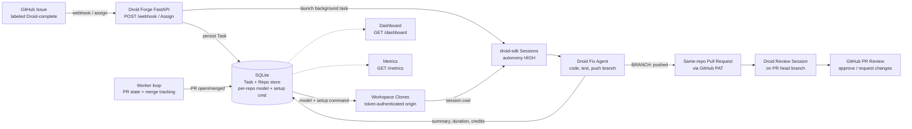

# Droid Forge — The AI Engineer That Delivers

A production-ready automation service that turns **GitHub Issues into merged Pull Requests** using the official [Factory Droid SDK](https://docs.factory.ai/sdk/python) (`droid-sdk`) running local [Droid](https://docs.factory.ai/droid-cli/overview) sessions. Label an issue, and the system dispatches a Droid agent to implement the fix, run the tests, push a branch, open a PR, review it with a second Droid agent, and report back on the issue — with full lifecycle tracking, metrics, and an operations dashboard.

> Previously "Cursor Forge": this service used Cursor Cloud Agents. It has been fully refactored onto Factory's Droid: every Cursor SDK call is now a `droid-sdk` call running where the app runs.

---

## Project Overview

When a GitHub Issue is labeled `Droid-complete` in a configured repository (e.g. your fork of [`apache/fineract`](https://github.com/apache/fineract)), this service:

1. Receives the webhook and validates its HMAC signature.
2. Persists a **Task** record in SQLite.
3. Launches a **local Droid session** via the Python SDK (`droid-sdk`) inside a fresh clone of the target repo. The clone's `origin` is authenticated with your GitHub token so the agent can push branches; an optional per-repo **setup command** (e.g. `npm ci`) runs before the session starts.
4. Streams the agent turn in a background asyncio task; Droid makes the requested changes, runs the project's tests, fixes failures, pushes a new branch, and reports `BRANCH: <name>` plus a summary.
5. On completion, forge opens a **same-repo pull request** with the forge `GITHUB_TOKEN` (`head=owner:branch`), stores the PR URL, summary, runtime, tokens and Factory credits, and posts a ✅ comment back on the original issue.
6. A **second Droid session** reviews the PR head branch, and forge posts its findings as a **GitHub PR review** (`APPROVE` / `REQUEST_CHANGES`, falling back to a comment when GitHub rejects self-approval).
7. Exposes a live **dashboard**, a **metrics endpoint**, an orchestration-grade **health endpoint**, and a **follow-up** API (`POST /api/tasks/{id}/follow-up`) for SDK `Session.resume` + stream.

**Two equivalent triggers**

1. **GitHub label** — apply `Droid-complete` on an issue. GitHub POSTs to `PUBLIC_BASE_URL/webhook` (tunnel required) and forge launches the session.
2. **Dashboard Assign** — **Add Issues** imports 5 open issues; **Assign to Droid** applies the same `Droid-complete` label on GitHub (so flow 1 can fire) and launches the session directly when `PUBLIC_BASE_URL` is unset (duplicates are ignored).

## Architecture

Droid sessions run **locally, next to the forge app** — in your venv, your laptop, or the Docker container — each inside its own workspace clone. The app is event-driven: session turns finish in background asyncio tasks and update the database immediately, while a worker loop reconciles GitHub-side PR/merge state.





Source: [`docs/architecture.mmd`](docs/architecture.mmd). To regenerate the PNG:

```bash
npx -p @mermaid-js/mermaid-cli mmdc \
  -i docs/architecture.mmd \
  -o docs/architecture.png \
  -b "#0b1220" -w 1500 -s 1
```

## Technology Stack

| Layer | Technology |
|---|---|
| Language | Python 3.12+ |
| Web framework | FastAPI + Uvicorn |
| Persistence | SQLite + SQLAlchemy 2.x |
| Agent runtime | Official Python [Droid SDK](https://docs.factory.ai/sdk/python) (`droid-sdk`) → local Droid sessions |
| Background work | Per-run asyncio tasks (event-driven) + GitHub state poller |
| HTTP client | httpx (async) for GitHub; `droid-sdk` for Droid |
| Config | pydantic-settings + python-dotenv |
| UI | Jinja2 + Bootstrap 5 |
| Container | Docker + Docker Compose |
| Tests | pytest + respx |

---

## Clone and replicate this setup

Follow these steps on any machine (macOS/Linux) to run the same stack end-to-end.

### Prerequisites

| Tool | Why |
|---|---|
| [Git](https://git-scm.com/) | Workspace clones + agent pushes |
| [Python 3.12+](https://www.python.org/downloads/) | Runtime |
| [Droid CLI](https://docs.factory.ai/droid-cli/quickstart) | The SDK drives `droid` as a subprocess (`curl -fsSL https://app.factory.ai/cli \| sh`, Homebrew, or npm) |
| [Docker Desktop](https://www.docker.com/products/docker-desktop/) *(optional)* | One-command container run |
| [GitHub CLI `gh`](https://cli.github.com/) *(recommended)* | Create webhooks / test issues |
| [ngrok](https://ngrok.com/) or [cloudflared](https://developers.cloudflare.com/cloudflare-one/connections/connect-apps/) | Expose `localhost:8000` so GitHub can reach `/webhook` |

You will also need:

1. A **GitHub personal access token** with permission to read repos, write issues/comments/labels, open PRs, and post PR reviews on the target repository.
2. A **Factory API key** from [Factory Settings → API Keys](https://app.factory.ai/settings/api-keys) (optional when the local `droid` CLI is already authenticated; required inside Docker).
3. A **webhook secret** string of your choosing (any long random value).

### 1. Clone the repository

```bash
git clone https://github.com/jan21deepak/cursor_ai_engineer.git
cd cursor_ai_engineer
```

### 2. Configure environment variables

```bash
cp .env.example .env
```

Edit `.env` and fill in at least:

```bash
GITHUB_WEBHOOK_SECRET=some-long-random-secret
GITHUB_TOKEN=<your-github-pat>
FACTORY_API_KEY=<your-factory-api-key>
TRIGGER_LABEL=Droid-complete
```

Optional: `DROID_MODEL` (default `auto` = Factory Router), `DROID_AUTONOMY` (default `high`, needed for git push), `DROID_REVIEW_AUTONOMY` (default `high`, review sessions), `DROID_USD_PER_AGENT_RUN` for ROI estimates, `DROID_TURN_TIMEOUT_SECONDS` (default 3600) for the per-turn wall-clock budget.

Verify the Droid key (the SDK uses the same key):

```bash
.venv/bin/python - <<'PY'
import asyncio, os
from droid_sdk import list_models

async def main():
    models = await list_models(api_key=os.environ["FACTORY_API_KEY"])
    print([m.id for m in models][:5])

asyncio.run(main())
PY
```

### 3. Run the service

**Option A — Local Python (sessions run on this machine)**

```bash
python3 -m venv .venv
source .venv/bin/activate          # Windows: .venv\Scripts\activate
pip install -r requirements.txt

mkdir -p data
.venv/bin/uvicorn app.app:app --host 0.0.0.0 --port 8000
```

**Option B — Docker (recommended for a clean replicate)**

```bash
docker compose up --build
```

This starts FastAPI on **http://localhost:8000**, initializes SQLite at `/data/tasks.db`, and keeps Droid sessions + workspace clones in the `droid_data` / `droid_home` volumes so runs survive restarts.

In another terminal (with the venv activated):

```bash
pytest -q
```

> Sessions run where the app runs. Your machine (or the container) must stay up for the duration of an agent run; Droid sessions persist on disk, so a service restart resumes interrupted runs automatically (see "Restart recovery").

### 4. Verify the app is healthy

```bash
curl -s http://localhost:8000/health | python3 -m json.tool
curl -s http://localhost:8000/metrics | python3 -m json.tool
open http://localhost:8000/dashboard   # or visit in a browser
```

Healthy response looks like:

```json
{
  "status": "healthy",
  "application": "ok",
  "checks": { "database": "ok", "github": "ok", "droid": "ok" }
}
```

If `github` or `droid` show as unreachable/unconfigured, the app still serves traffic (`degraded`) — fix the tokens in `.env` and restart.

### 5. Expose a public webhook URL (label-trigger flow)

GitHub cannot call `localhost`. Tunnel it:

```bash
# ngrok
ngrok http 8000
# → copy the https://….ngrok-free.app URL

# or cloudflared
cloudflared tunnel --url http://localhost:8000
```

Set `PUBLIC_BASE_URL` in `.env` to the tunnel URL and restart, then register repositories — forge installs the issues webhook on each repo automatically (or run `POST /api/webhooks/sync`).

The **Dashboard Assign** flow also works without a tunnel: it labels the issue on GitHub and launches the session directly.

### 6. Register the repo in the dashboard and trigger Droid

1. Open **http://localhost:8000/dashboard** → **Repositories** tab.
2. Paste `https://github.com/<owner>/<repo>` and click **Add repository**.
3. Optionally set a per-repo **model** and **setup command** (e.g. `npm ci`) on the row, then **Save**.
4. Click **Add Issues** (imports open issues from the fork's parent when applicable) or **Sync**.
5. On the **Issues** tab, select issues → **Assign to Droid**.

**Or trigger via the webhook label:**

```bash
# Create the label once
gh label create Droid-complete --repo <owner>/<repo> \
  --color 0E8A16 --description "Trigger Droid Forge automation" || true

# Open / label an issue
gh issue create --repo <owner>/<repo> \
  --title "Fix: example bug" \
  --body "Describe the change." \
  --label Droid-complete
```

### 7. Watch the result

- **Dashboard** tab: fix + review stats, engineering KPIs, daily activity chart (times in **SGT**).
- Original GitHub issue: ✅ completion comment with session id, PR URL, runtime, summary.
- Droid pushes a branch; forge opens the **same-repo** PR via PAT; a review session posts a **PR review**; merge state is refreshed from GitHub.
- Follow-ups: `POST /api/tasks/{id}/follow-up` resumes the same Droid session (blocked with 409 while a turn is streaming).

---

## How It Works

### GitHub Webhook Flow

1. GitHub delivers an `issues` event to `POST /webhook`.
2. The service verifies `X-Hub-Signature-256` with the shared secret (constant-time HMAC compare). Invalid → **401**.
3. Non-issue events are acknowledged and ignored (**200**).
4. Trigger rule: issue `opened` with the `Droid-complete` label, or the label being added (`labeled`). Anything else is ignored.
5. Duplicate protection: an active or completed task for the same repo + issue is not recreated.
6. A `Task` row is written to SQLite and the launch is fired in a background asyncio task (**202** — the response returns fast because GitHub kills webhook deliveries after ~10 seconds; workspace clones take longer).

### Droid Session Workflow

Each fix run:

1. **Workspace**: shallow clone of the target repo into `WORKSPACE_ROOT/<owner>/<repo>/task-<id>` with `https://x-access-token:<GITHUB_TOKEN>@github.com/...` as `origin` (so the agent's `git push` works), a Droid Forge git identity, and the optional per-repo setup command.
2. **Session**: `Session(cwd=<workspace>, model=<per-repo or DROID_MODEL>, config=SessionConfig(autonomy=HIGH, auto_reject_permission_requests=True))`, opened via the SDK and streamed in a background task.
3. **Turn**: the prompt includes the issue title/body and requires only the requested changes, running the test suite, pushing a new branch to `origin`, *not* opening a PR (automation does), and ending with `BRANCH: <name>`.
4. **Completion**: `RunResult` gives success/failure, text summary, `duration`, token usage and `factory_credits`; forge persists all of it, extracts the branch (from the `BRANCH:` line or `git rev-parse`), pushes it if the agent somehow didn't, and opens the same-repo PR via PAT (`head=owner:branch`, base = repo default / starting ref).

Failure mapping: `RunSuccess` → completed; `RunInterrupted` / `RunFailure` / timeout → failed (with the SDK error stored on the task).

### PR Review

A second, read-only Droid session (`Autonomy.OFF`, permission requests auto-rejected) checks out the PR head branch (`git fetch origin pull/N/head`) and reviews the diff for production readiness. Forge parses its `VERDICT: APPROVE | REQUEST_CHANGES` line and posts a GitHub PR review with the full findings. If GitHub rejects the verdict event (e.g. the token owner opened the PR), forge falls back to a plain review comment. `REVIEW_AUTO_MERGE=false` by default; set it to `true` to squash-merge after an approving verdict.

### Restart recovery

Droid sessions persist on disk (`~/.factory`). On startup, forge finds RUNNING rows whose session is no longer streaming and resumes them with a continuation prompt ("continue where you left off, push your branch, report `BRANCH:`"). Rows that never got a session (dispatch interrupted) are marked failed.

## Environment Variables

| Variable | Description | Default |
|---|---|---|
| `GITHUB_WEBHOOK_SECRET` | Shared secret for webhook HMAC validation | — |
| `PUBLIC_BASE_URL` | Public tunnel URL GitHub can reach (e.g. `https://….trycloudflare.com`). Enables label→webhook dispatch and `POST /api/webhooks/sync` | — |
| `GITHUB_TOKEN` | PAT used to clone/push branches, open same-repo PRs, comment and review | — |
| `FACTORY_API_KEY` | Factory API key (falls back to the droid CLI's own auth when `DROID_ALLOW_CLI_AUTH=true`; required in Docker) | — |
| `DROID_ALLOW_CLI_AUTH` | Use the local droid CLI's login when `FACTORY_API_KEY` is empty (local runs) | `false` |
| `DROID_MODEL` | Model id for sessions (`auto` = Factory Router) | `auto` |
| `DROID_AUTONOMY` | Autonomy for fix sessions: `off` / `low` / `medium` / `high` | `high` |
| `DROID_REVIEW_AUTONOMY` | Autonomy for PR review sessions. Do not set `off`: headless runs auto-reject permission requests, which aborts the review on ordinary read commands | `high` |
| `DROID_TURN_TIMEOUT_SECONDS` | Wall-clock budget for one Droid turn | `3600` |
| `WORKSPACE_ROOT` | Where per-task repository clones live | `./data/workspace` |
| `DATABASE_URL` | SQLAlchemy URL | `sqlite:///./data/tasks.db` |
| `POLL_INTERVAL_SECONDS` | GitHub state poll interval | `20` |
| `TRIGGER_LABEL` | Issue label that triggers automation | `Droid-complete` |
| `REVIEW_AUTO_MERGE` | Squash-merge after the Droid review approves (`true`/`false`) | `false` |
| `LOG_LEVEL` | Logging level | `INFO` |
| `JUNIOR_SWE_ANNUAL_COST_USD` | Assumed junior SWE fully-loaded cost | `150000` |
| `JUNIOR_HOURS_PER_ISSUE` | Hours a junior would spend per fix | `4.0` |
| `JUNIOR_HOURS_PER_REVIEW` | Hours a junior would spend per review | `1.0` |
| `DROID_USD_PER_AGENT_RUN` | Flat USD attributed per completed run when real credit usage is unavailable | `0` |

Time-to-Dollar Savings divides annual cost by **1,920** working hours/year. The service boots without API keys, logs warnings, and reports `degraded` on `/health`.

> **Schema note**: v2.0 renamed the task columns (`cursor_agent_id`→`droid_session_id`, etc.). Point `DATABASE_URL` at a fresh database; existing v1 SQLite files are not migrated (the lightweight migration system adds the new columns but old data is ignored).

## Dashboard

`GET /dashboard` — neon dark UI, auto-refreshes every 15 seconds while the Dashboard tab is active:

- Repositories / Issues / Dashboard tabs
- Per-repo **model** override + **setup command**
- Fix + review time stats (active Droid working time)
- Engineering KPIs (avg PR cycle time, PRs delivered, merge rate, change failure rate)
- Daily activity bar chart (last 14 days, SGT)
- Recent activity with Droid session ids and PR deep links

## Metrics Endpoint

`GET /metrics` — computed live from SQLite (fix/review buckets, engineering KPIs, daily series, ROI assumptions). Cost uses stored `cost_usd` / `DROID_USD_PER_AGENT_RUN`; token usage comes straight from the Droid sessions.

## Health Endpoint

`GET /health` — suitable for orchestration platforms (Kubernetes, ECS, Docker healthchecks):

```json
{
  "status": "healthy",
  "application": "ok",
  "checks": { "database": "ok", "github": "ok", "droid": "ok" }
}
```

- **200** — `healthy`, or `degraded` (external API unreachable/unconfigured; app still serves traffic)
- **503** — `unhealthy` (database unreachable)

## Observability

Structured single-line logs with ISO-8601 **SGT** timestamps and key=value context, covering: webhook received, task created, workspace prepared, session started, turn progress, turn finished, PR opened/reused, review started/completed, GitHub comment posted, and database updates.

```
2026-09-28T11:30:00.123+08:00 | INFO | app.droid | droid.turn_finished | session_id=sess-… kind=fix success=True events=142 duration_seconds=734.0
```

## Droid SDK (local sessions)

| Concept | Droid Forge usage |
|---|---|
| Session | `Session(cwd=<workspace>, model=…, config=SessionConfig(autonomy=HIGH))` per task |
| Turn | `session.stream(prompt)` streamed in a background asyncio task |
| Result | `RunResult.success/text/duration/usage.factory_credits` → task summary, runtime, cost |
| Follow-up | `Session.resume(session_id)` + stream (`POST /api/tasks/{id}/follow-up`) |
| Restart recovery | `Session.resume` + a continuation prompt for orphaned RUNNING rows |
| PR review | Read-only review session on the PR head branch → GitHub PR review |
| Model catalog | `list_models()` → `/api/droid/models` dropdown |
| Trigger label | `Droid-complete` |

Canonical docs: [Droid Python SDK](https://docs.factory.ai/sdk/python), [Droid Exec](https://docs.factory.ai/droid-exec/overview).

## Future Improvements

- **Queue-based dispatch** (Celery / Redis) for horizontal scaling beyond the in-process launcher
- **Postgres** backend for multi-replica deployments
- **Workspace retention policy** (currently kept for session resumability)
- **Streaming session events** into the dashboard activity feed (SDK partial events)
- **Slack / Teams notifications** on task completion
- **Auth (OIDC)** on the dashboard and metrics endpoints
- **Per-repo prompt templates** (model + setup mapping is already supported)
- **Droid Computers** as per-repo remote compute targets (the SDK accepts `machine_id`)
