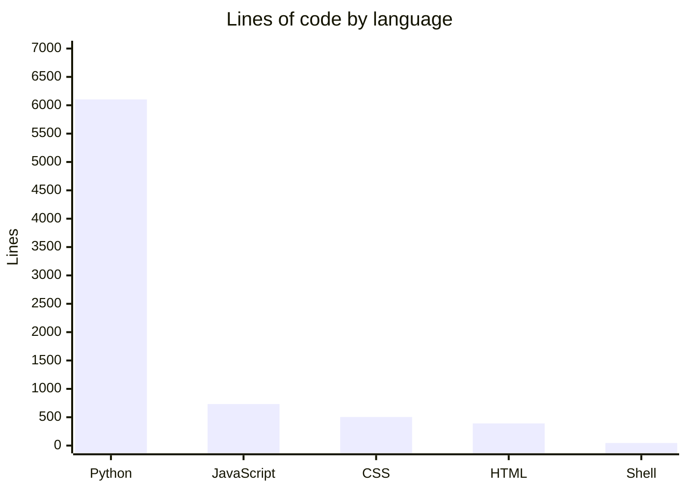
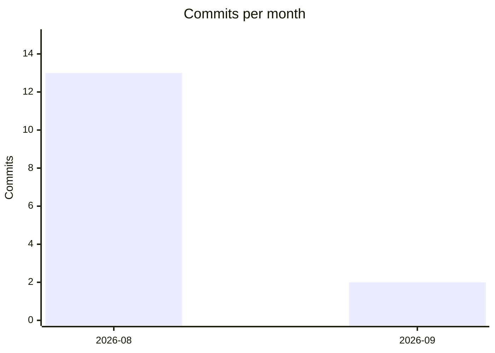
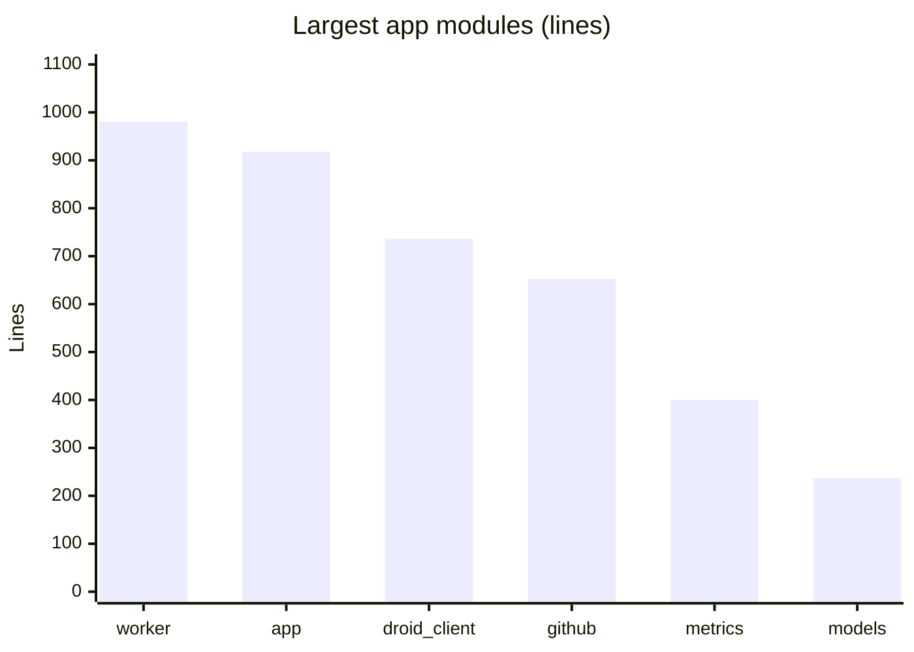

# By the numbers

Data collected on 2026-09-28.

Every figure below comes from `wc -l` over the tracked tree and from `git log` in this repository. Percentages are rounded. This page deliberately contains no per-person contributor data.

## Size

The repository tracks 36 files. Counting only code (Python, JavaScript, CSS, HTML, shell), the tree holds 7,774 lines.

| Language | Files | Lines | Share of code lines |
| --- | --- | --- | --- |
| Python (`app/` plus `tests/`) | 22 | 6,103 | 78% |
| JavaScript (`app/static/dashboard.js`) | 1 | 732 | 9% |
| CSS (`app/static/dashboard.css`) | 1 | 503 | 6% |
| HTML (`app/templates/dashboard.html`) | 1 | 391 | 5% |
| Shell (`scripts/create_superset_issues.sh`) | 1 | 45 | 1% |

Python dominates at 78%. The only non-Python runtime surface is the dashboard: 1,626 lines across three files (`app/static/dashboard.js`, `app/static/dashboard.css`, `app/templates/dashboard.html`), about 21% of code lines. The shell script is a small issue-seeding helper, not part of the service.

Broken down by role instead of language:

| Category | Files | Lines |
| --- | --- | --- |
| Source (13 `app/` modules, dashboard JS/CSS/HTML) | 16 | 6,757 |
| Tests (`tests/`) | 9 | 1,772 |
| Helper script | 1 | 45 |
| Config (Dockerfile, docker-compose.yml, requirements.txt, pytest.ini, .env.example, .gitignore, .dockerignore) | 7 | 142 |
| Docs (README.md, docs/architecture.mmd) | 2 | 397 |

## Activity

15 commits, first on 2026-08-09, latest on 2026-09-28, a 50-day span. The work arrived in two bursts: 13 commits over three days in August, then 2 commits on a single day in September.

All 15 commits fall inside the last 90 days, so the churn list below covers the entire history. Count of commits that touched each path:

| Path | Commits touching it |
| --- | --- |
| `README.md` | 10 |
| `app/worker.py` | 7 |
| `app/config.py` | 7 |
| `app/app.py` | 7 |
| `.env.example` | 7 |
| `app/github.py` | 5 |
| `app/models.py` | 5 |
| `app/templates/dashboard.html` | 5 |
| `tests/test_worker.py` | 5 |
| `tests/test_runtime.py` | 5 |
| `docs/architecture.mmd` | 5 |

Two paths that no longer exist also appear in the churn history: `app/cursor_client.py` and `tests/test_cursor_client.py` were each touched by 4 commits before the September refactor deleted them. By directory, `app/` absorbed 73 file-touch events, `tests/` 38, and `README.md` 10.

## Bot-attributed commits

8 of the 15 commits (53%) carry a bot as author or co-author:

- 2 commits co-authored by `factory-droid[bot]`, both on 2026-09-28 (the Droid refactor and its follow-up bugfix commit).
- 5 commits co-authored by `Cursor <cursoragent@cursor.com>`, between 2026-08-10 and 2026-08-11.
- 1 commit authored by `Cursor Agent` (2026-08-10), which arrived through pull request #1.

Treat 53% as a lower bound. A bot-written commit only shows up in this count when it carries a trailer, and trailers are voluntary. One August commit is titled "Refresh remaining files so GitHub no longer attributes them to migration commits", so attribution was being actively managed at the time, and any agent work without a trailer is invisible here.

## Complexity

The largest source files:

| File | Lines |
| --- | --- |
| `app/worker.py` | 981 |
| `app/app.py` | 918 |
| `app/droid_client.py` | 736 |
| `app/github.py` | 652 |
| `app/metrics.py` | 400 |
| `app/models.py` | 237 |

`app/worker.py` is the biggest module. It holds finalization, PR creation, review posting, GitHub state polling, and restart recovery. `app/app.py` holds all 19 HTTP routes plus startup wiring. Everything else stays under 800 lines, and eight of the 13 modules are below 250 lines.

Test mass relative to code is substantial: 1,772 test lines against 4,331 `app/` lines, a test-to-code ratio of about 41%. The suite holds 85 tests in 9 files. The largest test file is `tests/test_metrics.py` at 545 lines; the smallest meaningful ones cover a single concern, like `tests/test_health.py` at 21 lines.

## Related pages

- [Architecture](overview/architecture.md) for what each of the 13 modules does.
- [Lore](lore.md) for the history behind these numbers.
- [Patterns and conventions](how-to-contribute/patterns-and-conventions.md) for how the modules are written.
