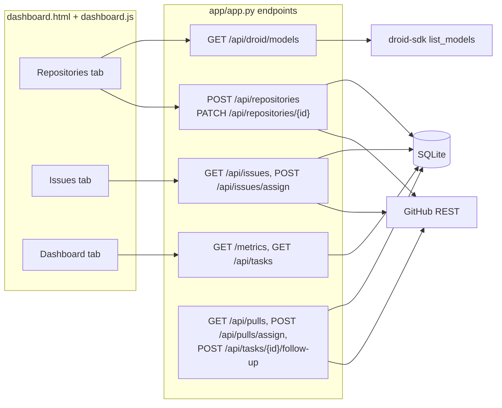

# Dashboard

Active contributors: jan21deepak

## Purpose

The dashboard is the operator surface: one page to register repositories, pick issues for the agent, and watch every fix and review run. It is server-rendered Jinja2 plus vanilla JS, with all live data coming from JSON endpoints in `app/app.py`.

## How it works

**The page.** `GET /dashboard` in `app/app.py` renders `app/templates/dashboard.html` with `compute_metrics` (`app/metrics.py`) and the first page of `recent_activity` (ten items). `asset_version()` appends the newest `dashboard.*` mtime from `app/static/`, so browsers pick up new `app/static/dashboard.js` or `app/static/dashboard.css` after a deploy. `GET /` redirects here. The page has three tabs: Repositories, Issues, and Dashboard.

**Repositories tab.** The add form posts to `POST /api/repositories`: `parse_repository_ref` in `app/repos.py` parses the URL or slug, GitHub metadata is fetched, and a `Repository` row is inserted with the starting ref defaulting to the repository's default branch. `_ensure_repo_automation` ensures the trigger label exists and, when `PUBLIC_BASE_URL` is set, installs an issues webhook. Each row offers a model dropdown and a setup command input; Save sends `PATCH /api/repositories/{id}` with `droid_model` and `setup_command`. The dropdown is fed by `GET /api/droid/models`, which lists the catalog from `DroidClient.list_available_models()` (the SDK's `list_models`, disabled entries filtered) and always offers "Default (auto)" (the global `DROID_MODEL`; `auto` means Factory Router). A saved model that is no longer listed stays visible as "(saved)". These per-repo settings flow into sessions through `resolve_agent_launch_config`. Add Issues posts to `POST /api/repositories/{id}/issues`, which copies up to five new open issues from a fork's parent (deduplicated by a "Source issue:" marker; non-forks get a 422). Remove calls `DELETE /api/repositories/{id}`, which also deletes the repo's synced issues and PRs.

**Issues tab.** `GET /api/issues` returns synced open issues grouped by repository, each with an `assigned` flag (a queued, running, or completed task exists for that repository and issue). Assigned rows are shown but disabled, groups paginate ten at a time, and "Select all open" checks a group. Assign to Droid posts to `POST /api/issues/assign`: the endpoint ensures and adds the trigger label on GitHub, then either waits briefly for the webhook to create the task (up to about four seconds when `PUBLIC_BASE_URL` is set) or dispatches directly through `create_and_dispatch_task`, with duplicate protection either way. The UI then refreshes and jumps to the Dashboard tab.

**Dashboard tab.** Cards show running, completed, failed, and success rate, each split into fixes and reviews, then fix and review time stats (average and total minutes of active Droid working time), a Time-to-Dollar savings card (ROI math against the junior SWE assumptions in `app/config.py`), and engineering KPIs (average PR cycle time, PRs delivered in 7 days, merge rate, change failure rate). A Chart.js daily activity chart plots the last 14 days in SGT: fixes completed and failed, reviews completed, PRs opened, plus a runtime line. All of it comes from `GET /metrics`. The tab auto-refreshes every 15 seconds while visible.

**Recent activity.** `GET /api/tasks` returns `recent_activity` output: `Task` and `ReviewTask` rows merged and paginated server-side. Each row shows the fix or review badge, repository, the issue or PR target, status (with a Merged marker), the first eight characters of the Droid session id, a PR deep link, runtime, and completion time in SGT. Per-run credits and tokens are stored on each row and returned by this endpoint, and `/metrics` totals them (`total_factory_credits`, `tokens_used`); no card renders them today.

**PR assignment and follow-up.** Two more controls are JSON-only so far. `GET /api/pulls` refreshes open non-draft PRs from GitHub and `POST /api/pulls/assign` starts review sessions on the selected `SyncedPullRequest` rows (see [PR review](pr-review.md)). `POST /api/tasks/{id}/follow-up` takes an instruction, resumes the task's Droid session through `DroidClient.send_follow_up` (the prompt keeps the branch and must end with a `BRANCH:` line), and flips the task back to `running`; it answers 409 when the session is mid-turn or missing and 503 when Droid is unconfigured.

## Integration points

- Metrics and activity come from `compute_metrics` and `recent_activity` in `app/metrics.py`.
- Repository settings edited here are consumed by every agent launch (`resolve_agent_launch_config` in `app/repos.py`).
- Assignment relies on the GitHub label and webhook machinery from [Issue to PR](issue-to-pr.md).
- The PR assign and follow-up endpoints drive [PR review](pr-review.md) and the fix finalizer.

## Entry points for modification

- Markup: `app/templates/dashboard.html` (cards, tabs, tooltips, server-rendered activity rows).
- Behavior: `app/static/dashboard.js` (fetches, rendering, 15-second refresh, pagination).
- Endpoints: the handlers in `app/app.py`.
- KPI and ROI math: `app/metrics.py` and the assumptions in `app/config.py`.

## Key source files

| Path | Purpose |
| --- | --- |
| `app/app.py` | `GET /dashboard` and every JSON endpoint the UI calls |
| `app/templates/dashboard.html` | Page structure, metric cards, activity table |
| `app/static/dashboard.js` | Tab logic, dropdowns, chart, refresh and paging |
| `app/static/dashboard.css` | Theme |
| `app/metrics.py` | `compute_metrics`, `recent_activity` |

## Related pages

- [Issue to PR](issue-to-pr.md) for what Assign to Droid sets in motion.
- [PR review](pr-review.md) for the PR assignment endpoint.
- [Overview](../overview/index.md) for how the dashboard fits the whole service.
