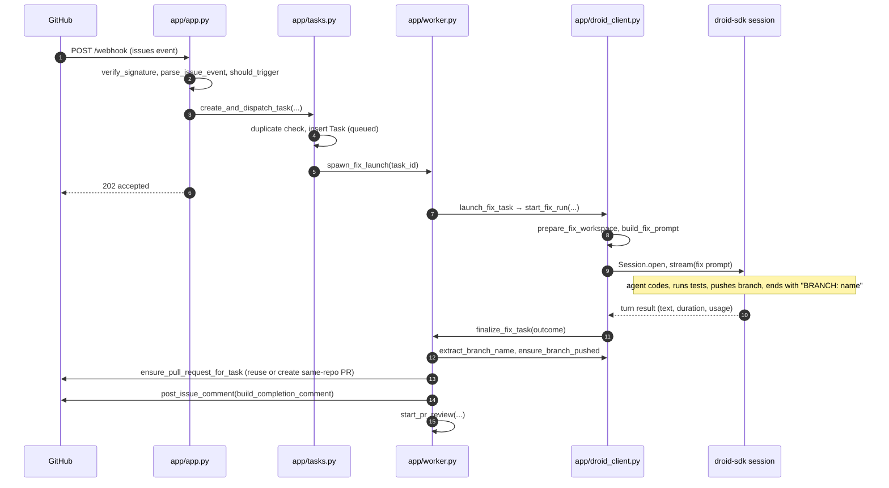

# Issue to PR

Active contributors: jan21deepak

## Purpose

Issue to PR is the flagship workflow: a GitHub issue carrying the trigger label (default `Droid-complete`, from `trigger_label` in `app/config.py`) comes back as a same-repo pull request with a completion comment, implemented by a local Droid agent. The review stage, the metrics, and the dashboard all read the rows this pipeline writes.

## How it works

**Intake.** GitHub delivers an `issues` event to `POST /webhook` in `app/app.py`. `verify_signature` in `app/github.py` validates `X-Hub-Signature-256` with a constant-time HMAC compare, `parse_issue_event` extracts the repository, issue number, title, body, and labels, and `should_trigger` fires only when an issue is opened with the trigger label or the label is added to it. Ping and other event types are acknowledged and ignored. The dashboard reaches the same dispatch: `POST /api/issues/assign` in `app/app.py` adds the trigger label on GitHub, then either waits briefly for the webhook to create the task (when `PUBLIC_BASE_URL` is set) or calls `create_and_dispatch_task` directly.

**Dispatch.** `create_and_dispatch_task` in `app/tasks.py` rejects duplicates: a queued, running, or completed task for the same repository and issue number returns the existing task id (failed tasks can be retried). It inserts a `Task` row in `queued` and fires `spawn_fix_launch` from `app/worker.py`, a background asyncio task registered in the run registry as `launch:task-<id>`, so the webhook answers `202` immediately (GitHub abandons deliveries after about ten seconds). `launch_fix_task` resolves the per-repo launch config (model, setup command, starting ref) with `resolve_agent_launch_config` in `app/repos.py`, calls `DroidClient.start_fix_run`, and on success stores the `droid_session_id` and flips the row to `running`.

**Fix turn.** `start_fix_run` in `app/droid_client.py` prepares the per-task clone (see [Workspace management](workspace-management.md)), builds the prompt with `build_fix_prompt` from `FIX_PROMPT_TEMPLATE`, and opens a droid-sdk `Session` whose cwd is the clone, at `DROID_AUTONOMY` (default `high`) with `auto_reject_permission_requests=True`, then streams the turn in a background task under the `DROID_TURN_TIMEOUT_SECONDS` budget. The prompt tells the agent to make only the requested changes, run the test suite, create a new branch, and push it to `origin`. It must not open a pull request, and on forks it must not touch the upstream repository.

The prompt contract: the final response must end with a line `BRANCH: <name>` followed by a short summary. `extract_branch_name` parses that line with `_BRANCH_RE`, and follow-up turns carry the same contract.

**Finalization.** When the turn ends, `DroidClient._run_turn` calls the worker's `on_complete` callback, `finalize_fix_task` in `app/worker.py`. It maps the outcome with `map_outcome_status` (success becomes `completed`, anything else `failed` with the SDK error stored), persists the summary, duration, token usage, and Factory credits, and stamps `completed_at`. On success it extracts the branch, falling back to `DroidClient.current_branch` when the summary has no `BRANCH:` line, calls `ensure_branch_pushed` as a safety net, and moves on to the PR. Follow-up turns (see [Dashboard](dashboard.md)) finish through this same finalizer.

**PR creation and comment.** `ensure_pull_request_for_task` first reuses an open PR for that head branch if one exists, otherwise it calls `GitHubClient.create_pull_request` with `head` normalized to `owner:branch` (a same-repo PR, base = starting ref or the repository default branch), a title referencing the issue, and a body naming the Droid session. `_persist_task_pr_url` writes the PR URL and `pr_state=open` immediately, so a later crash cannot lose the link. `build_completion_comment` renders the session id, PR URL, runtime, and completion time in SGT, and `GitHubClient.post_issue_comment` posts it on the issue. Finally `start_pr_review` hands the PR to the review session (see [PR review](pr-review.md)).

## Integration points

- GitHub webhook delivery and the REST API (labels, PRs, issue comments), all through `GitHubClient` in `app/github.py`.
- droid-sdk local sessions, opened and streamed by `DroidClient` (see [Droid client](../systems/droid-client.md)).
- `Task` rows in SQLite, consumed by the review stage, restart recovery, metrics, and the dashboard (see [Persistence](../systems/persistence.md)).
- The HTTP surface around this flow is listed in [REST endpoints](../api/rest-endpoints.md).

## Entry points for modification

- Trigger rule: `should_trigger` in `app/github.py`, or the `trigger_label` setting in `app/config.py`.
- Prompt wording: `FIX_PROMPT_TEMPLATE` and `build_fix_prompt` in `app/droid_client.py`. Keep the `BRANCH:` line, or change `extract_branch_name` with it.
- PR creation policy: `ensure_pull_request_for_task` in `app/worker.py`.
- Comment text: `build_completion_comment` in `app/worker.py`.
- Duplicate policy: the status filter inside `create_and_dispatch_task` in `app/tasks.py`.

## Key source files

| Path | Purpose |
| --- | --- |
| `app/app.py` | Webhook handler, signature check, dashboard assign paths |
| `app/tasks.py` | Duplicate-safe `Task` creation and background launch |
| `app/worker.py` | `launch_fix_task`, `finalize_fix_task`, PR creation, completion comment |
| `app/droid_client.py` | Fix prompt, workspace prep, session streaming, `BRANCH:` parsing |
| `app/github.py` | Signature verification, event parsing, trigger rule, REST client |
| `app/models.py` | `Task` row and `TaskStatus` constants |

## Related pages

- [PR review](pr-review.md) for what happens to the PR after it opens.
- [Workspace management](workspace-management.md) for the clone the fix turn runs in.
- [Restart recovery](restart-recovery.md) for interrupted fix turns.
