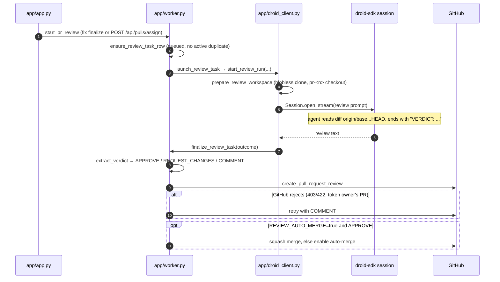

# PR review

Active contributors: jan21deepak

## Purpose

The PR review feature is the second half of the pipeline: a read-only Droid session inspects a pull request and posts its findings on GitHub as a formal review, with a verdict of APPROVE or REQUEST_CHANGES. Reviews run automatically on every PR the fix pipeline opens, and can also be pointed at any open non-draft PR through the API. Each review is tracked as a `ReviewTask` row.

## How it works

**Triggers.** `finalize_fix_task` in `app/worker.py` calls `start_pr_review` as its last step, once a PR URL exists on the task. Separately, `POST /api/pulls/assign` in `app/app.py` starts reviews on selected `SyncedPullRequest` rows, open non-draft PRs that `GET /api/pulls` refreshes from GitHub for every registered repository.

**Row and launch.** `ensure_review_task_row` in `app/worker.py` creates a `ReviewTask` row in `queued` unless an active one already exists for the same repository and PR number. `start_pr_review` launches `launch_review_task` in the background and refuses to double-launch: when the run registry already has that review in flight, the launch task is cancelled and the answer is `already_running`.

**Review session.** `launch_review_task` resolves the base ref (per-repo starting ref, else the repository default branch). `DroidClient.start_review_run` in `app/droid_client.py` prepares the review clone (a blobless full-history clone; see [Workspace management](workspace-management.md)), builds the prompt with `build_review_prompt` from `REVIEW_PROMPT_TEMPLATE`, and opens a droid-sdk `Session` at `DROID_REVIEW_AUTONOMY` (default `high`) with `auto_reject_permission_requests=True`. The prompt asks for a production-readiness review of `git diff origin/<base>...HEAD` and forbids modifying files, pushing branches, or opening PRs. The verdict contract: the response must end with exactly one line, `VERDICT: APPROVE` or `VERDICT: REQUEST_CHANGES`.

Review autonomy must not be `off`. Headless runs auto-reject permission requests, and with `Autonomy.OFF` the review agent asks permission for ordinary read commands, which aborts the run. The read-only behavior comes from the prompt; the autonomy setting only controls prompting.

**Verdict and posting.** When the turn ends, `finalize_review_task` in `app/worker.py` persists status, summary, duration, and Factory credits on the review row. `extract_verdict` pulls the verdict line (case-insensitive, uppercased), and the verdict maps to a GitHub review event: APPROVE, REQUEST_CHANGES, or COMMENT when the text has no verdict line. The summary becomes the review body, truncated at `REVIEW_BODY_LIMIT` (60,000 characters), and `GitHubClient.create_pull_request_review` posts it. GitHub rejects APPROVE and REQUEST_CHANGES when the token owner authored the PR, so on 403 or 422 the handler retries once with a COMMENT review and records the downgrade. The `review.completed` log event carries the verdict and whether the review posted.

**Auto-merge.** With `REVIEW_AUTO_MERGE=true` and an approving verdict, `_attempt_auto_merge` squash-merges the PR (commit title `<pr title> (#n)`). When GitHub blocks the merge (405, 409, or 422), it falls back to `enable_auto_merge`, which turns on GitHub's auto-merge through GraphQL so the PR lands once its checks pass. Both outcomes are recorded on the review row (`merged`, `auto_merge_enabled`). The default is `false`, which keeps humans in the merge decision. The worker loop (`poll_github_state` in `app/worker.py`) also re-checks completed, unmerged reviews on every poll and retries auto-merge there.

**The ReviewTask record.** One review is one `ReviewTask` row in `app/models.py`: repository and PR coordinates, `droid_session_id`, status, `summary`, `error`, `factory_credits`, `duration_seconds`, `merged`, and `auto_merge_enabled`. The dashboard activity feed shows reviews with kind `review` (see [Dashboard](dashboard.md)).

## Integration points

- GitHub pulls and reviews REST endpoints through `GitHubClient` in `app/github.py`, plus the GraphQL auto-merge mutation.
- droid-sdk review sessions, opened by `start_review_run` with review-specific autonomy (see [Droid client](../systems/droid-client.md)).
- `ReviewTask` rows feed the dashboard feed and the review metrics bucket in `compute_metrics` (`app/metrics.py`).
- The fix pipeline hands over through `start_pr_review` (see [Issue to PR](issue-to-pr.md)).

## Entry points for modification

- Prompt wording: `REVIEW_PROMPT_TEMPLATE` and `build_review_prompt` in `app/droid_client.py`. Keep the `VERDICT:` line, or change `extract_verdict` with it.
- Review autonomy: `droid_review_autonomy` in `app/config.py` (never `off`).
- Verdict-to-event mapping and the COMMENT fallback: `finalize_review_task` and `REVIEW_BODY_LIMIT` in `app/worker.py`.
- Merge behavior: `review_auto_merge` in `app/config.py` and `_attempt_auto_merge` in `app/worker.py`.

## Key source files

| Path | Purpose |
| --- | --- |
| `app/worker.py` | Review row creation, launch, finalization, verdict posting, auto-merge |
| `app/droid_client.py` | Review prompt, review workspace, session streaming, `VERDICT:` parsing |
| `app/github.py` | `create_pull_request_review`, squash merge, GraphQL auto-merge |
| `app/models.py` | `ReviewTask` row |
| `app/app.py` | `POST /api/pulls/assign` and `GET /api/pulls` |

## Related pages

- [Issue to PR](issue-to-pr.md) for how reviewed PRs come to exist.
- [Workspace management](workspace-management.md) for why review clones keep full history.
- [Dashboard](dashboard.md) for the review rows in the activity feed.
