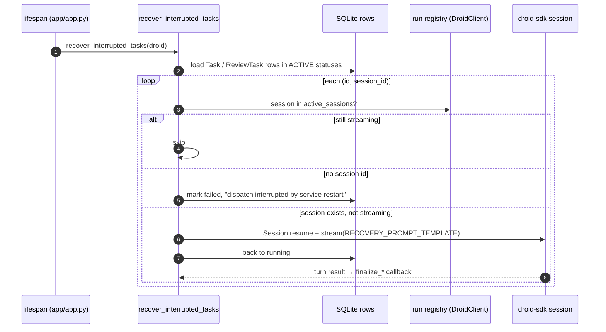

# Restart recovery

Active contributors: jan21deepak

## Purpose

Restart recovery decides what happens to in-flight Droid runs when the service restarts. Droid sessions persist on disk, so a restart does not have to lose them: `recover_interrupted_tasks` in `app/worker.py` resumes the sessions that can still run and fails the rows that cannot, all before the API starts the worker loop.

## How it works

**When it runs.** The `lifespan` handler in `app/app.py` initializes the database, calls `recover_interrupted_tasks(droid)`, and only then starts `worker_loop`. Shutdown is the mirror image: the loop's stop event fires, then `DroidClient.shutdown()` cancels in-flight turns. The SDK saves session state on cancel, and `_run_turn` records a cancelled outcome before re-raising.

**What it inspects.** The function loads every `Task` and `ReviewTask` row whose status is in `TaskStatus.ACTIVE` (`queued` or `running`), snapshots their `(id, droid_session_id)` pairs, then decides per row.

**The run registry drives the decision.** `DroidClient` tracks every in-flight turn in a registry (`_tasks`), keyed by session id, or by `launch:<id>` before a session exists. `active_sessions` returns the keys that are real sessions and not yet done. That set is what separates the three outcomes:

- Session id present and in `active_sessions`: the turn is still streaming inside this process. Nothing to do.
- No session id: the launch was interrupted before a session opened. The row is marked `failed` with the error "dispatch interrupted by service restart" and logged as `recovery.dispatch_lost`.
- Session id present but not streaming: `DroidClient.resume_interrupted` opens `Session.resume(session_id)` and streams `RECOVERY_PROMPT_TEMPLATE` in a new background turn. The prompt tells the agent the service restarted, asks it to continue from where it left off, restate the final summary if the work is already done, push its branch to `origin`, and end with a `BRANCH: <name>` line. The row flips back to `running`, and the normal `on_complete` path (`finalize_fix_task` or `finalize_review_task`) finishes the job, including PR creation and the completion comment.

If the resume itself fails (the session file is gone, the key is wrong), the row is marked `failed` with "session lost after service restart: <error>" and logged as `recovery.session_lost`. Review rows also stamp `completed_at` on the failure path. A `recovery.completed` event summarizes how many rows were recovered. After a real restart the registry is empty, so every active row falls into the resume or fail branch; the skip branch only matters within one process.

**Why resume works.** Two pieces of state survive the restart: the Droid session under the droid CLI's home directory (`/home/appuser/.factory` in the Docker image), and the workspace clone, which `prepare_fix_workspace` reuses instead of recloning (see [Workspace management](workspace-management.md)). The resumed session finds its checkout, branch, and any uncommitted work exactly where it left them.

Follow-ups use the same SDK mechanism: `send_follow_up` in `app/droid_client.py` also calls `Session.resume`, so the follow-up endpoint works on any session the registry does not currently hold mid-turn.

## Integration points

- Startup order in `lifespan` (`app/app.py`): recovery runs after `init_db` and before `worker_loop`.
- droid-sdk `Session.resume`; sessions persist under the droid CLI home directory.
- The registry (`track`, `active_sessions`, `session_busy` in `app/droid_client.py`) is shared with follow-ups (the 409 busy answer) and `start_pr_review` (the `already_running` answer).
- Log events: `recovery.dispatch_lost`, `recovery.session_lost`, `recovery.completed`.

## Entry points for modification

- Recovery prompt: `RECOVERY_PROMPT_TEMPLATE` in `app/droid_client.py`. Keep the `BRANCH:` line, or change `extract_branch_name` with it.
- The decision ladder: `recover_interrupted_tasks` in `app/worker.py`.
- Registry semantics: `track` and `active_sessions` in `DroidClient`, if you change how turns are keyed.
- Startup ordering: `lifespan` in `app/app.py`.

## Key source files

| Path | Purpose |
| --- | --- |
| `app/worker.py` | `recover_interrupted_tasks` and the fix/review finalizers it re-attaches |
| `app/droid_client.py` | Run registry, `resume_interrupted`, recovery prompt |
| `app/app.py` | `lifespan` startup and shutdown order |
| `app/models.py` | `Task`, `ReviewTask`, and `TaskStatus.ACTIVE` |

## Related pages

- [Issue to PR](issue-to-pr.md) for the finalization path a resumed turn re-enters.
- [Workspace management](workspace-management.md) for the clone reuse that makes resume possible.
- [Dashboard](dashboard.md) for the follow-up control that shares the resume mechanism.
