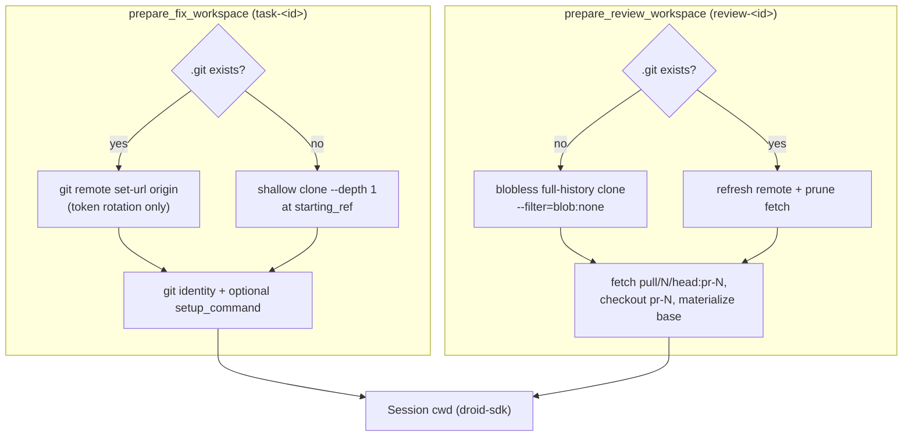

# Workspace management

Active contributors: jan21deepak

## Purpose

Every Droid turn runs inside a git clone on the forge machine. `DroidClient` in `app/droid_client.py` owns those clones: where they live, how they authenticate pushes, what runs inside them before the session starts, and how they are reused after a restart. Fix and review workspaces use different clone strategies on purpose, because they need different git history.

## How it works

**Layout.** Clones live under `WORKSPACE_ROOT` (default `./data/workspace`, `/data/workspace` in the Docker image). `task_workspace_dir(repository, task_id)` resolves to `<root>/<owner>/<repo>/task-<id>` and `review_workspace_dir(repository, review_id)` to `<root>/<owner>/<repo>/review-<id>`. One clone exists per task or review row, so concurrent sessions never share a checkout.

**Fix workspaces.** `prepare_fix_workspace` makes a shallow clone (`git clone --depth 1`, with `--branch <starting_ref>` when a per-repo starting ref is set). The `origin` URL is authenticated: `_remote_url` embeds the GitHub token as `https://x-access-token:<token>@github.com/<owner>/<repo>.git`, so the agent's `git push` works without prompting. The clone gets the git identity `Droid Forge <droid-forge@users.noreply.github.com>`. When the registered repository has a `setup_command` (for example `npm ci`), `_run_setup_command` runs it with `/bin/sh -c` inside the clone under a 900-second budget (`SETUP_TIMEOUT_SECONDS`); a non-zero exit or a timeout is logged as a warning, never fatal to the run. If a clone partially succeeds (an unknown ref, say), the directory is kept and the session proceeds with what is there.

**Reuse on restart.** If the workspace already contains a `.git` directory, nothing is recloned. Only `git remote set-url origin` runs, so a rotated token still works, and the session resumes in the same directory it left (see [Restart recovery](restart-recovery.md)).

**Review workspaces.** `prepare_review_workspace` uses a blobless full-history clone: `git clone --filter=blob:none`. The review prompt asks the agent to run `git diff origin/<base>...HEAD`, and a shallow clone has no common history with the PR branch, so git answers "no merge base" and the diff fails. A blobless clone keeps the full commit graph (the merge base exists) while fetching file contents on demand. The PR head is fetched with `git fetch --force origin pull/<n>/head:pr-<n>` and force-checked out, and the local base branch is materialized after the checkout, because git refuses to update the ref the worktree has checked out. On reuse, the remote URL is refreshed and `git fetch --filter=blob:none --prune origin` runs before the PR fetch.

**Branch push fallback.** `ensure_branch_pushed(repository, task_id, branch)` checks `git ls-remote origin refs/heads/<branch>`, and if the branch is missing it pushes `HEAD:refs/heads/<branch>`. `finalize_fix_task` in `app/worker.py` calls it before opening the PR, covering the case where the agent reports a branch but its push did not land. `current_branch` (`git rev-parse --abbrev-ref HEAD`) is the fallback when a summary has no `BRANCH:` line.

**Git plumbing.** Every git call goes through `_git` in `app/droid_client.py`: a subprocess with `GIT_TERMINAL_PROMPT=0` (git never blocks asking for credentials), a 300-second timeout (`GIT_TIMEOUT_SECONDS`), and failures raised as `DroidRunError`. Workspaces are never deleted; they stay so sessions remain resumable, which is why `README.md` lists a retention policy as future work.

## Integration points

- Workspaces are the `cwd` of every droid-sdk session (see [Droid client](../systems/droid-client.md)).
- The GitHub token sits in cleartext inside each clone's `.git/config`, so treat `WORKSPACE_ROOT` as secret-bearing.
- Per-repo `starting_ref` and `setup_command` come from `Repository` rows through `resolve_agent_launch_config` in `app/repos.py`.
- Docker persists `/data` (workspaces plus database) and `/home/appuser/.factory` (Droid sessions) as volumes, so both survive container restarts.

## Entry points for modification

- Location: `workspace_root` in `app/config.py`.
- Path scheme: `task_workspace_dir` and `review_workspace_dir` in `app/droid_client.py`.
- Clone strategy: the git flags inside `prepare_fix_workspace` and `prepare_review_workspace`.
- Remote authentication format: `_remote_url` in `app/droid_client.py`.
- Setup command handling: `_run_setup_command` and `SETUP_TIMEOUT_SECONDS`.
- Push fallback: `ensure_branch_pushed` in `app/droid_client.py`.

## Key source files

| Path | Purpose |
| --- | --- |
| `app/droid_client.py` | All workspace prep, remotes, git plumbing, push fallback |
| `app/worker.py` | Caller of `ensure_branch_pushed` during fix finalization |
| `app/repos.py` | Per-repo `setup_command` and `starting_ref` lookup |
| `app/config.py` | `WORKSPACE_ROOT` and token settings |
| `docker-compose.yml` | Volume persistence for `/data` and the droid home |

## Related pages

- [Issue to PR](issue-to-pr.md) and [PR review](pr-review.md) for the runs that use these clones.
- [Restart recovery](restart-recovery.md) for why clones are reused rather than recreated.
