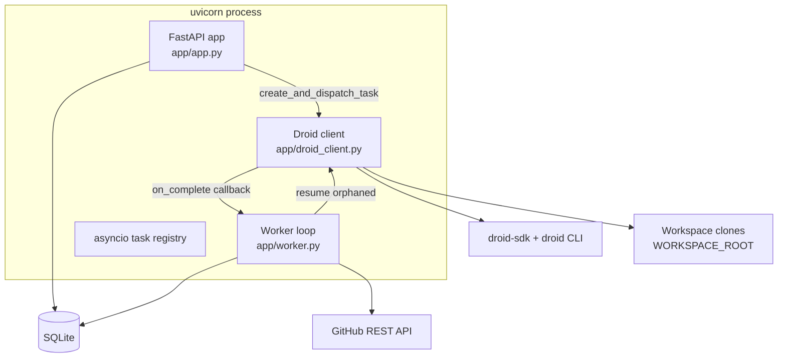
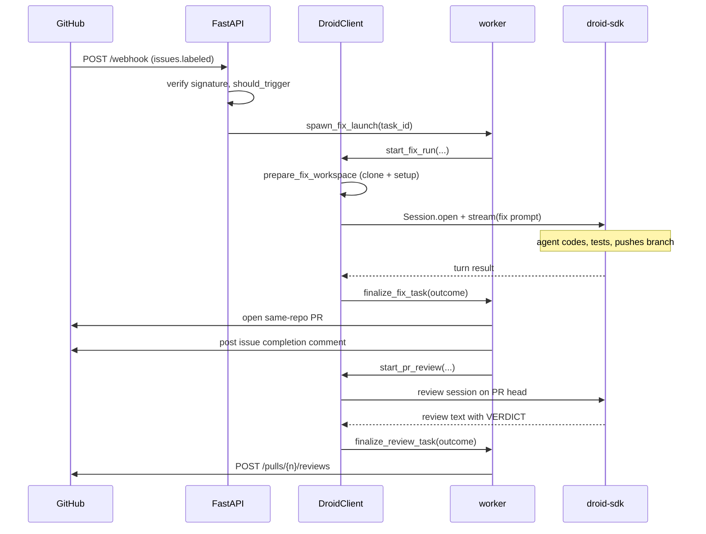

# Architecture

Droid Forge is a single FastAPI application with an embedded background worker. All orchestration, agent execution, and persistence run in one process; the only external dependencies are the GitHub REST API and the Factory agent runtime.

## Components

| Component | File | Role |
| --- | --- | --- |
| HTTP + lifecycle | `app/app.py` | Routes, health, dashboard rendering, startup recovery |
| Task dispatch | `app/tasks.py` | Duplicate-safe task creation, background launch |
| Droid facade | `app/droid_client.py` | Workspace prep, session lifecycle, prompt/parse helpers |
| Finalization + polling | `app/worker.py` | Turn callbacks, PR creation, review posting, restart recovery |
| GitHub client | `app/github.py` | Webhook verification, REST calls, label/webhook setup |
| Persistence | `app/models.py`, `app/database.py` | ORM models, engine, lightweight migrations |
| Configuration | `app/config.py` | Environment-backed settings |
| Metrics | `app/metrics.py` | Dashboard and KPI aggregates |
| Logging | `app/logging_conf.py` | Structured event logging |

## Runtime model

Two things move a task forward.

1. **Event-driven finalization.** `DroidClient` opens a Droid session and streams the turn in a background asyncio task. When the turn ends, the client calls an `on_complete` callback that the worker supplies. `finalize_fix_task` and `finalize_review_task` own everything that happens after a turn: persistence, PR creation, comments, review posting.
2. **A polling loop.** `worker_loop` runs every `POLL_INTERVAL_SECONDS` and reconciles GitHub-side state that no callback observes: PR opened/merged, and merge of reviewed PRs. It does not poll the Droid runtime, because turns report completion directly.

## Concurrency and isolation

Each task and each review gets its own workspace directory under `WORKSPACE_ROOT`, keyed by repository and row id (`task-<id>`, `review-<id>`). Workspaces are reused across restarts so an interrupted session can resume in place.

The client keeps a registry of in-flight asyncio tasks keyed by session id (or `launch:<id>` before a session exists). The registry enforces one turn per session, exposes `active_sessions` for recovery decisions, and is drained on shutdown.

## Trust boundaries

- Incoming webhooks are verified with HMAC SHA-256 (`verify_signature` in `app/github.py`) before any work starts.
- Outbound GitHub calls use a personal access token; the token is embedded in clone remotes as `https://x-access-token:<token>@github.com/...`.
- The Droid runtime is a local subprocess. Sessions persist under the droid CLI's home directory so they survive restarts.

## Related pages

- [Droid client](../systems/droid-client.md) for session and workspace mechanics.
- [Worker](../systems/worker.md) for finalization and recovery.
- [Persistence](../systems/persistence.md) for the schema and migrations.
- [Deployment](../deployment.md) for the container topology.
