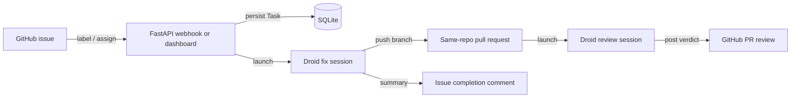

# Droid Forge overview

Droid Forge is a self-hosted FastAPI service that turns labeled GitHub issues into reviewed pull requests by running local Droid agents. You register a repository, label or assign an issue, and the service clones the repo, runs a Droid session that implements the fix, opens a same-repo pull request, and starts a second Droid session that reviews the change and posts the verdict back to GitHub.

The service previously delegated work to Cursor Cloud Agents. It now runs Droid sessions in-process through `droid-sdk`, so the agent workspace, the orchestration, and the review all live on the same machine. See [Migration from Cursor](../background/migration-from-cursor.md) for what changed and why.

## What it does

- Watches registered repositories for the `Droid-complete` label (or a manual **Assign to Droid** click in the dashboard).
- Runs one Droid fix session per issue inside a per-task clone with an authenticated push remote, implemented in `app/droid_client.py`.
- Opens a same-repo pull request with the forge token once the agent pushes its branch, in `app/worker.py`.
- Runs a read-only Droid review session against the PR head and posts the review to GitHub with an approve or request-changes verdict.
- Tracks cost, tokens, runtime, and delivery KPIs on a dashboard and JSON metrics endpoint.

## Who uses it

The primary user is an engineer who wants a labeled issue to come back as a reviewable pull request. A secondary user is whoever runs the deployment: the service is a single container or a single uvicorn process with an embedded worker loop.

## How a request flows

## Quick links

- [Architecture](architecture.md) for the component map and control flow.
- [Getting started](getting-started.md) to run it locally.
- [Glossary](glossary.md) for the vocabulary used across these pages.
- [Issue to PR](../features/issue-to-pr.md) for the end-to-end workflow.
- [REST endpoints](../api/rest-endpoints.md) for the HTTP surface.
- [Configuration](../reference/configuration.md) for every environment variable.
