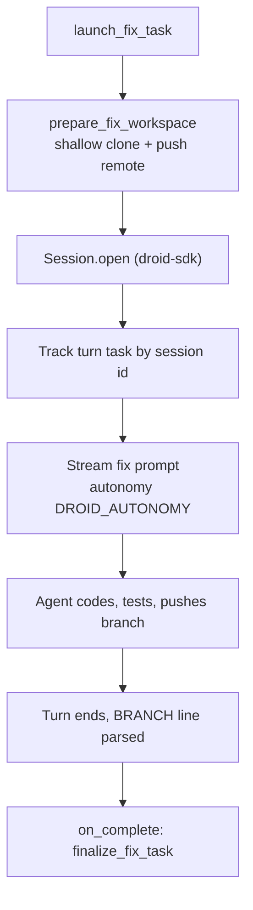

# Droid client

Active contributors: jan21deepak

## Purpose

`app/droid_client.py` is the async facade over local Droid sessions. For every fix or review it prepares a workspace clone with an authenticated push remote, opens a `droid_sdk.Session` inside it, streams the turn in a background asyncio task, and hands the outcome to an `on_complete` callback. The run registry keeps shutdown orderly and makes recovery after a restart possible through `Session.resume`.

## Directory layout

One module, `app/droid_client.py`, plus settings from `app/config.py`, slug parsing from `app/repos.py`, and logging via `app/logging_conf.py`.

## Key abstractions

| Type or function | File | Description |
| --- | --- | --- |
| `DroidClient` | `app/droid_client.py` | Process-wide client: workspace prep, session lifecycle, run registry. |
| `track`, `session_busy`, `active_sessions`, `shutdown` | `app/droid_client.py` | In-flight turn registry, busy guard, orderly drain. |
| `start_fix_run`, `start_review_run` | `app/droid_client.py` | Prepare workspace, open session, stream one turn in background. |
| `send_follow_up`, `resume_interrupted` | `app/droid_client.py` | Resume a saved session for a new instruction or a restart. |
| `prepare_fix_workspace`, `prepare_review_workspace` | `app/droid_client.py` | Clone and refresh the per-task and per-review workspaces. |
| `build_fix_prompt`, `build_review_prompt`, `build_follow_up_prompt` | `app/droid_client.py` | Format the four prompt templates. |
| `extract_branch_name`, `extract_verdict`, `map_outcome_status` | `app/droid_client.py` | Parse the `BRANCH:` and `VERDICT:` lines, map turn success to `TaskStatus`. |
| `task_workspace_dir`, `review_workspace_dir`, `workspace_root` | `app/droid_client.py` | Paths under `WORKSPACE_ROOT`: `<owner>/<repo>/task-<id>` or `review-<id>`. |
| `current_branch`, `ensure_branch_pushed` | `app/droid_client.py` | Read the workspace HEAD, push the branch if origin lacks it. |
| `check_connectivity`, `list_available_models` | `app/droid_client.py` | Probe the Factory runtime, list enabled models for the dashboard. |
| `get_droid_client`, `DroidRunError`, `DroidSessionBusyError` | `app/droid_client.py` | Singleton accessor and the two run failure types. |

## How it works

### Run registry

Every background turn is an asyncio task in `DroidClient._tasks`, keyed by session id once a session exists, or `launch:<id>` while only a launcher runs. `track` raises `DroidSessionBusyError` when the same key is already in flight, and a done callback removes the key when the turn finishes. `active_sessions` returns the live session ids (not `launch:*`, not done); the recovery pass uses it to skip sessions still streaming. `shutdown` cancels and drains every pending task. Sessions persist on disk, so a cancelled turn stays resumable.

### Workspace preparation

Fix workspaces are shallow clones (`git clone --depth 1`, optionally `--branch <starting_ref>`) with the remote rewritten to `https://x-access-token:<token>@github.com/<owner>/<repo>.git` so the agent can push, and git identity set to `Droid Forge`. If the directory already has a `.git` (restart recovery), the client only refreshes the remote URL, which keeps agent state and works with a rotated token. An optional per-repo `setup_command` runs before the session opens (900 second timeout, failures only warn).

Review workspaces need full history: a blobless clone (`--filter=blob:none`), the PR head fetched as `pr-<n>` and force-checked-out, and the base branch materialized locally only after checkout, because a fresh clone leaves the default branch checked out and git refuses to force-update the current worktree ref. The blobless clone is a fix for a real failure: a shallow clone shares no history with the PR branch, so the review prompt's `git diff base...HEAD` fails with "no merge base".

### Session config and autonomy

`_session_config` builds a `SessionConfig` with `auto_reject_permission_requests=True`, so headless turns never hang waiting for a human answer. Autonomy comes from `DROID_AUTONOMY` (fix) and `DROID_REVIEW_AUTONOMY` (review), mapped from `off`, `low`, `medium`, `high` with `high` as the fallback. Review autonomy must not be `off`: an OFF review agent asks for permission on ordinary read commands, the request is auto-rejected, and the run aborts. The prompt keeps the review read-only; autonomy only controls prompting.

### Prompts and required output lines

The fix prompt requires the agent to branch, run tests, push to origin, and end with a line of the form `BRANCH: <branch-name>`. The review prompt requires a diff review and exactly one final line, `VERDICT: APPROVE` or `VERDICT: REQUEST_CHANGES`; the follow-up and recovery prompts repeat the `BRANCH:` requirement. `extract_branch_name` and `extract_verdict` parse those lines; `map_outcome_status` turns the turn's `success` flag into `TaskStatus.COMPLETED` or `FAILED`.

### Turns, follow-ups, and recovery

`_run_turn` streams the prompt with a wall-clock timeout (`DROID_TURN_TIMEOUT_SECONDS`, default 3600), logs progress every 25 events, records success, subtype, text, duration, credits, and token counts, closes the session in a `finally`, then awaits `on_complete`. `send_follow_up` resumes a session with a new instruction; `resume_interrupted` resumes an orphaned session with the recovery prompt. Both refuse when a turn is already in flight.

### Connectivity and models

`configured` is true with a Factory API key, or with `DROID_ALLOW_CLI_AUTH` on and the `droid` CLI on PATH. `check_connectivity` calls `droid_sdk.list_models`; `list_available_models` filters out disabled models and feeds the dashboard model dropdown (`GET /api/droid/models` in `app/app.py`).

## Integration points

- The worker passes `on_complete` callbacks: `finalize_fix_task` for fix, follow-up, and recovery turns, `finalize_review_task` for reviews. See [Worker](worker.md).
- `app/app.py` uses the singleton for health checks, the model dropdown, follow-up dispatch, and lifespan shutdown.
- Workspace and auth settings come from `app/config.py`; see [Configuration](../reference/configuration.md).

## Entry points for modification

- Prompt wording and required output lines: the four `*_PROMPT_TEMPLATE` constants and the `_BRANCH_RE` / `_VERDICT_RE` regexes must stay in sync.
- Autonomy behavior: the `autonomy` mapping and `_session_config`.
- Workspace layout and clone strategy: `task_workspace_dir`, `review_workspace_dir`, and the two `prepare_*` methods.
- Turn outcome fields: `_run_turn` shapes the outcome dict consumed by finalizers.

## Key source files

| Path | Purpose |
| --- | --- |
| `app/droid_client.py` | Client, registry, prompts, workspaces, parsing helpers. |
| `app/config.py` | Model, autonomy, timeout, workspace, and auth settings. |
| `app/repos.py` | Repository slug parsing for workspace paths. |
| `app/worker.py` | Callers that supply `on_complete` and consume outcomes. |

## Related pages

- [Worker](worker.md) for what happens after a turn ends.
- [Webhook and dispatch](webhook-and-dispatch.md) for how a run gets started.
- [Architecture](../overview/architecture.md) for the component map.
