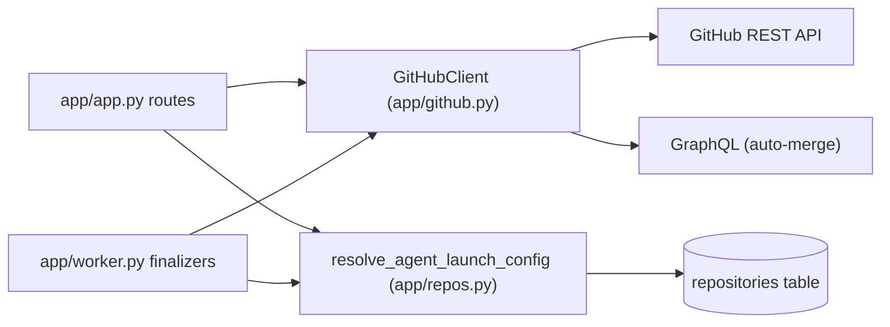

# GitHub integration

Active contributors: jan21deepak

## Purpose

`app/github.py` is the GitHub surface of the service. It verifies webhook signatures with HMAC SHA-256, parses `issues` payloads into `IssueEvent` objects, decides whether an event should trigger a run, and exposes a minimal async REST client for comments, labels, issues, webhook installation, pull requests, reviews, and merges. `app/repos.py` holds the helpers that turn a repository URL into an `owner/repo` slug and a slug into a Droid launch config.

## Directory layout

- `app/github.py`: signature verification, event parsing, trigger rules, `GitHubClient`.
- `app/repos.py`: `parse_repository_ref` and `resolve_agent_launch_config`.
- `app/config.py`: token, API URL, webhook secret, and trigger label settings.

## Key abstractions

| Type or function | File | Description |
| --- | --- | --- |
| `verify_signature` | `app/github.py` | Constant-time HMAC SHA-256 check of `X-Hub-Signature-256` against the raw body. |
| `IssueEvent`, `parse_issue_event` | `app/github.py` | Dataclass and parser for `issues` webhook payloads. |
| `should_trigger` | `app/github.py` | Trigger on `opened` with the label, or on the label being added. |
| `GitHubClient` | `app/github.py` | Async REST client; one `httpx.AsyncClient` per call. |
| `create_pull_request` | `app/github.py` | Open a PR; `same_repo=True` normalizes head to `owner:branch`. |
| `create_pull_request_review` | `app/github.py` | Post COMMENT, APPROVE, or REQUEST_CHANGES reviews. |
| `merge_pull_request`, `enable_auto_merge` | `app/github.py` | REST merge (default squash) and GraphQL auto-merge enablement. |
| `ensure_label`, `ensure_issues_webhook` | `app/github.py` | Idempotent setup of the trigger label and the issues webhook. |
| `parse_repository_ref` | `app/repos.py` | GitHub URL or slug to `owner/repo`, or None. |
| `resolve_agent_launch_config` | `app/repos.py` | Per-repo model, setup command, and starting ref from the `repositories` table. |

## How it works

### Signatures and trigger rules

`verify_signature` computes `sha256=<hex>` over the raw request body and compares it in constant time. When no webhook secret is configured it logs `webhook.signature_skipped` and returns True, which is a local-development convenience rather than a production posture. `should_trigger` fires on two shapes only: an issue opened while already carrying the trigger label, and the trigger label added to an existing issue. Everything else is ignored upstream; see [Webhook and dispatch](webhook-and-dispatch.md).

### Client conventions

Every method builds a fresh `httpx.AsyncClient`, sends `Accept: application/vnd.github+json`, `X-GitHub-Api-Version: 2022-11-28`, and a `Bearer` token when configured, and targets `GITHUB_API_URL` (default `https://api.github.com`). Soft failures (comments, labels) return False after logging; operations callers must react to (PR creation, reviews, merges) raise `httpx` errors. `check_connectivity` probes `/rate_limit` for the health endpoint. Listing methods paginate with a page cap (issues and PRs up to 5 pages, comments and reviews until a short batch).

### Same-repo pull requests

`create_pull_request` with `same_repo=True` rewrites the head to `owner:branch`, so the PR opens inside the target repository instead of comparing a fork against its upstream parent. After creation it verifies that the returned base repository is the target repository; if not, it logs `github.pr_wrong_base_repo` and raises `RuntimeError`. A 422 response logs `github.pr_create_rejected` before raising, so the race with an already-open PR stays visible. `find_open_pull_request_for_head` locates an existing open PR by head ref, with a list-and-match fallback.

### Reviews and merges

`create_pull_request_review` posts an `event` of COMMENT, APPROVE, or REQUEST_CHANGES. GitHub rejects APPROVE and REQUEST_CHANGES when the token owner authored the PR, so callers retry with COMMENT on 403 or 422. `merge_pull_request` PUTs `/pulls/{n}/merge` (default squash, optional commit title). `enable_auto_merge` fetches the PR's `node_id` and runs the GraphQL `enablePullRequestAutoMerge` mutation with `SQUASH`.

### Webhook installation

`ensure_issues_webhook` appends `/webhook` to the public URL when missing, lists existing hooks, and PATCHes the hook whose URL matches (or a fallback hook that already points at a `/webhook` path with `issues` events), otherwise POSTs a new one. The hook config is `content_type: json`, the configured secret, and `insecure_ssl: 0`.

### Repo helpers

`parse_repository_ref` accepts `https://github.com/owner/repo` (optional `.git`, optional trailing slash) or `owner/repo` and returns the slug, or None. `resolve_agent_launch_config` looks up the `Repository` row (with a case-insensitive fallback) and returns the per-repo model, setup command, and starting ref. Registered repos default `starting_ref` to `main`; unregistered slugs yield empty config so callers fall back to global settings.

## Integration points

- The webhook route uses `verify_signature`, `parse_issue_event`, and `should_trigger`; see [Webhook and dispatch](webhook-and-dispatch.md).
- The worker uses PR find, create, get, reviews, merge, and auto-merge; see [Worker](worker.md).
- Repository registration (`POST /api/repositories`) and `POST /api/webhooks/sync` call `ensure_label` and, when `PUBLIC_BASE_URL` is set, `ensure_issues_webhook`.
- `app/droid_client.py` embeds the same token in clone remote URLs for authenticated pushes.

## Entry points for modification

- New GitHub operations: add a method to `GitHubClient` following the one-client-per-call pattern.
- Trigger semantics: `should_trigger` is the single decision point.
- Webhook payload changes: `parse_issue_event` and `IssueEvent`.
- Per-repo launch knobs: the `Repository` model in `app/models.py` plus `resolve_agent_launch_config`.

## Key source files

| Path | Purpose |
| --- | --- |
| `app/github.py` | Signature verification, event parsing, REST and GraphQL client. |
| `app/repos.py` | Slug parsing and launch-config resolution. |
| `app/config.py` | `GITHUB_TOKEN`, `GITHUB_API_URL`, `GITHUB_WEBHOOK_SECRET`, `TRIGGER_LABEL`. |
| `app/models.py` | The `Repository` row that backs launch config. |

## Related pages

- [Webhook and dispatch](webhook-and-dispatch.md) for intake and trigger rules in context.
- [Worker](worker.md) for PR creation, review posting, and merges in the run lifecycle.
- [Issue to PR](../features/issue-to-pr.md) for the end-to-end workflow.
