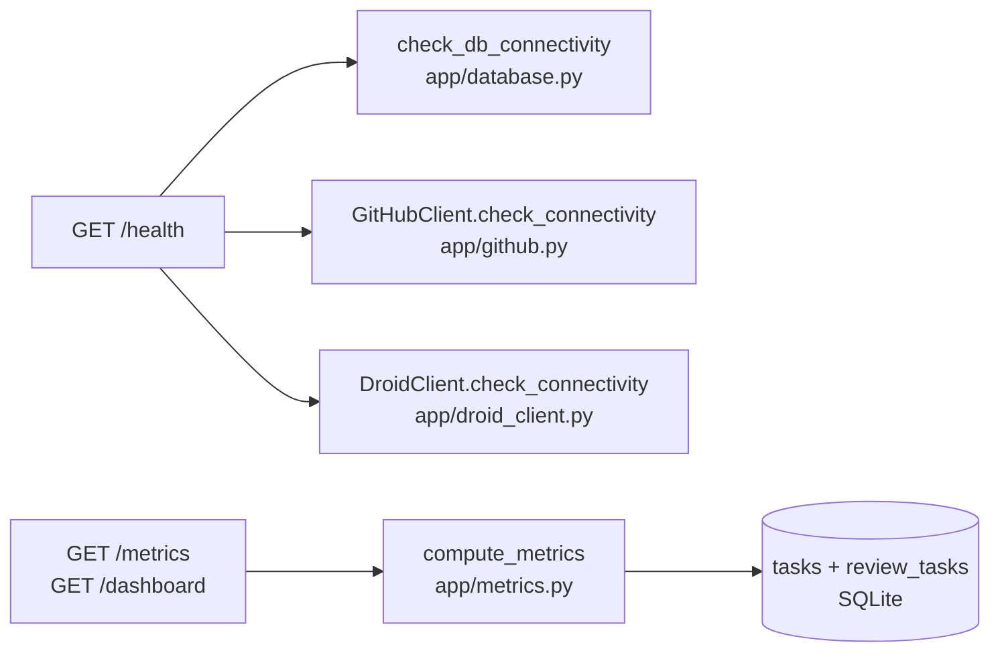

# Observability

Active contributors: jan21deepak

## Purpose

Three surfaces tell you what Droid Forge is doing: structured single-line logs for every state change, a health endpoint that probes the three dependencies, and a metrics module that aggregates delivery, cost, and KPI numbers live from SQLite. All user-facing timestamps are Singapore time (SGT, UTC+08:00, no DST).

## Directory layout

- `app/logging_conf.py`: formatter, `setup_logging`, `log_event`.
- `app/timeutil.py`: SGT conversion helpers.
- `app/metrics.py`: `compute_metrics`, `daily_activity`, `recent_activity`, `task_cost_usd`.
- `app/app.py`: the `/health` and `/metrics` routes.

## Key abstractions

| Type or function | File | Description |
| --- | --- | --- |
| `setup_logging` | `app/logging_conf.py` | Install the stdout handler, set the root level, quiet `uvicorn.access`. |
| `StructuredFormatter` | `app/logging_conf.py` | `timestamp, LEVEL, logger, event, key=value` lines. |
| `log_event` | `app/logging_conf.py` | `log_event(logger, level, event, **ctx)`; context rides in `extra["ctx"]`. |
| `/health` | `app/app.py` | Probe database, GitHub, and Droid; healthy, degraded, or unhealthy. |
| `check_db_connectivity` | `app/database.py` | `SELECT 1` probe. |
| `GitHubClient.check_connectivity` | `app/github.py` | `GET /rate_limit` probe. |
| `DroidClient.check_connectivity` | `app/droid_client.py` | `droid_sdk.list_models` probe. |
| `compute_metrics` | `app/metrics.py` | Full dashboard aggregate, served by `GET /metrics`. |
| `daily_activity` | `app/metrics.py` | 14 SGT-day buckets of fixes, reviews, PRs, and runtime. |
| `recent_activity` | `app/metrics.py` | Paginated fix plus review feed for `/api/tasks` and the dashboard. |
| `task_cost_usd` | `app/metrics.py` | Stored `cost_usd`, else the flat `DROID_USD_PER_AGENT_RUN` for finished runs. |

## How it works

### Structured logging

`setup_logging` runs at startup from the lifespan in `app/app.py`: it clears existing root handlers, installs one stdout handler with `StructuredFormatter`, sets the level from `LOG_LEVEL`, and drops `uvicorn.access` to WARNING. The formatter emits one line per record: an ISO-8601 SGT timestamp with milliseconds, level, logger name, the event name, then `key=value` context pairs, with exception text appended when present.

`log_event(logger, level, event, **ctx)` is how modules log state changes. The event name is the message itself (for example `task.status_changed` or `github.pr_created`); every other detail is a keyword field. Event names are dotted and usually prefixed by the emitting area, such as `webhook.*`, `github.*`, `droid.*`, `task.*`, `review.*`, `recovery.*`, and `db.*`. A few exception paths use `logger.exception` directly.

### The keyword-collision rule

Context keys must never be named `event` (or `logger` or `level`): those names belong to `log_event`'s own parameters, so passing them raises `TypeError` at call time. This bit once in a real run, which is why `app/worker.py` logs the review verdict as `verdict=` and `app/github.py` logs it as `review_event=`, even though the GitHub API parameter is called `event`. When adding a log call, pick a specific context key name.

### Health

`GET /health` runs three checks and maps them to one status. The database check runs `SELECT 1`; the GitHub check hits `/rate_limit`; the Droid check calls `list_models` on the Factory runtime. A database failure is `unhealthy` with HTTP 503. A working database with GitHub or Droid down is `degraded` (HTTP 200). All three up is `healthy` (HTTP 200). Individual checks report `unconfigured` instead of `error` when the token or API key is simply missing.

### Metrics

`GET /metrics` returns `compute_metrics(session)`, computed live over the tables described in [Persistence](persistence.md):

- Fix and review buckets (`total`, `running`, `completed`, `failed`, `success_rate`, average and total runtime) plus combined top-line counts. Fix metrics count only `Task` rows with a `droid_session_id`.
- Engineering KPIs: `pr_cycle_time_hours` (preferring agent-reported `duration_seconds` over wall clock), `prs_last_7_days`, `merge_rate_percent` measured over every PR Droid opened, and `change_failure_rate_percent` across finished fix and review runs.
- Usage and cost: tokens from `estimated_tokens`, `total_factory_credits`, `agent_cost_usd` from `task_cost_usd`, and a junior-engineer cost comparison whose assumptions and formula ship inside the `assumptions` block.
- `daily`: `daily_activity` buckets the last 14 SGT days (fixes completed, fixes failed, reviews completed, PRs opened, runtime minutes) for the dashboard chart.

`recent_activity` paginates the combined fix and review feed (page size capped at 100); `all_activity` returns everything untrimmed.

## Integration points

- Every module logs state changes through `log_event` in `app/logging_conf.py`.
- The dashboard route (`GET /dashboard`) renders `compute_metrics` plus `recent_activity` server-side.
- SGT rendering comes from `app/timeutil.py` (`format_sgt`, `iso_sgt`) and is used by the `to_dict` methods on every model.

## Entry points for modification

- New log events: call `log_event` with a dotted, area-prefixed name and specific context keys (never `event`, `logger`, or `level`).
- New health checks: extend the `/health` route; keep the unhealthy, degraded, healthy mapping.
- New dashboard numbers: extend `compute_metrics`; keep every value a direct count or average over rows.

## Key source files

| Path | Purpose |
| --- | --- |
| `app/logging_conf.py` | Formatter and `log_event`. |
| `app/timeutil.py` | SGT helpers. |
| `app/metrics.py` | Metrics and activity aggregation. |
| `app/app.py` | `/health` and `/metrics` routes. |

## Related pages

- [Persistence](persistence.md) for the tables metrics are computed from.
- [Configuration](../reference/configuration.md) for cost assumptions and `LOG_LEVEL`.
- [Architecture](../overview/architecture.md) for the component map.
