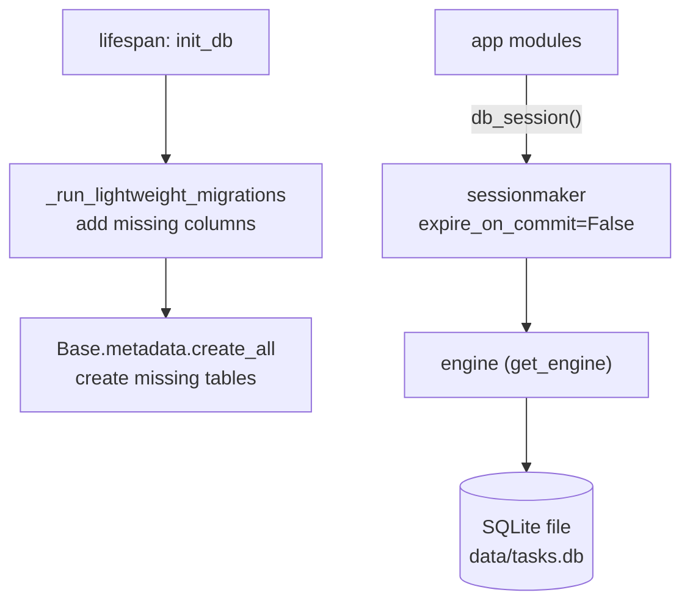

# Persistence

Active contributors: jan21deepak

## Purpose

Droid Forge stores everything in a single SQLite database through SQLAlchemy 2.x. `app/database.py` owns the engine, the session factory, and a lightweight additive migration runner; `app/models.py` defines the five tables and the status constants. One process (the uvicorn app with its embedded worker) touches the database, always through the `db_session` context manager.

## Directory layout

- `app/database.py`: engine singleton, session factory, `db_session`, migrations, connectivity check.
- `app/models.py`: `Base`, `TaskStatus`, and the five ORM models.
- `app/config.py`: `DATABASE_URL` (default `sqlite:///./data/tasks.db`).

## Key abstractions

| Type or function | File | Description |
| --- | --- | --- |
| `get_engine` | `app/database.py` | Lazily create the engine; make the SQLite parent directory; set `check_same_thread: False`. |
| `get_session_factory` | `app/database.py` | Cached `sessionmaker` with `expire_on_commit=False`. |
| `db_session` | `app/database.py` | Context manager: commit on success, rollback on exception, always close. |
| `init_db` | `app/database.py` | Run migrations, then `Base.metadata.create_all`. |
| `_run_lightweight_migrations` | `app/database.py` | Add columns that exist in models but not in existing tables. |
| `check_db_connectivity` | `app/database.py` | `SELECT 1` probe used by the health endpoint. |
| `reset_for_tests` | `app/database.py` | Drop cached engine and factory between tests. |
| `TaskStatus` | `app/models.py` | `queued`, `running`, `completed`, `failed`, plus `ACTIVE` and `ALL` tuples. |
| `Repository`, `SyncedIssue`, `Task`, `SyncedPullRequest`, `ReviewTask` | `app/models.py` | The five tables. |

## How it works

### Engine and sessions

`get_engine` creates one engine per process. For SQLite URLs the parent directory of the database file is created on demand, and `check_same_thread: False` is set because sessions are opened from async handlers and background tasks. `get_session_factory` builds a `sessionmaker` with `expire_on_commit=False`, so rows keep their loaded values after commit; that is what lets the worker hold a detached `Task` snapshot and still read fresh fields. `db_session` is the only access pattern: it commits on success, rolls back on exception, and closes the session. Long work (clones, HTTP calls, Droid turns) happens outside a session; rows are loaded, mutated, and flushed inside short blocks.

### Tables and key columns

| Table | Key columns |
| --- | --- |
| `repositories` | `full_name` (unique), `url`, `description`, `setup_command`, `droid_model`, `starting_ref`, `created_at`. |
| `synced_issues` | Unique `(repository, issue_number)`, `title`, `body`, `state`, `labels` (JSON text), `html_url`, `synced_at`. |
| `tasks` | `repository`, `issue_number`, `droid_session_id`, `status`, `pull_request_url`, `pr_state`, `pr_merged_at`, `summary`, `error`, `factory_credits`, `estimated_tokens`, `cost_usd`, `duration_seconds`, timestamps. |
| `synced_pull_requests` | Unique `(repository, pr_number)`, `title`, `html_url`, `head_sha`, `author`, `draft`, `synced_at`. |
| `review_tasks` | `repository`, `pr_number`, `pr_title`, `pr_url`, `droid_session_id`, `status`, `merged`, `auto_merge_enabled`, `summary`, `error`, `factory_credits`, `cost_usd`, `duration_seconds`, timestamps. |

`Task` rows exist even when Droid never launched (queued, no session id), which is why fix metrics filter on `droid_session_id` being present.

### Statuses

`TaskStatus` is plain string constants stored in indexed `String(32)` columns: `queued`, `running`, `completed`, `failed`. `ACTIVE` is `(queued, running)` and is what recovery and duplicate checks query. `Task` and `ReviewTask` share the same constants.

### Migrations, and the caveat

`init_db` runs `_run_lightweight_migrations` before `create_all`. The runner inspects each existing table, compares its column names with the model, and issues `ALTER TABLE ... ADD COLUMN` for anything new, logging `db.migration_applied`. New tables come from `create_all`. The caveat: this is additive only and there is no versioned migration framework. Renames, type changes, dropped columns, and new indexes on existing tables are not handled; those need manual SQL or a fresh database file. In practice the runner exists so an upgraded container keeps working against an older SQLite file.

## Integration points

- Every module uses `db_session`; there is no request-scoped dependency injection.
- `resolve_agent_launch_config` in `app/repos.py` reads `repositories` to configure launches.
- Metrics in `app/metrics.py` are computed live from these tables; see [Observability](observability.md).
- Tests reset state with `reset_for_tests` and a fresh database per test.

## Entry points for modification

- New tables or columns: add the model in `app/models.py`; the runner picks up new columns and `create_all` picks up new tables on the next start.
- Anything beyond additive changes: manual SQL, or document a database reset.
- Storage location: `DATABASE_URL` in `app/config.py`.

## Key source files

| Path | Purpose |
| --- | --- |
| `app/database.py` | Engine, sessions, migrations, connectivity. |
| `app/models.py` | Tables, statuses, `to_dict` serializers. |
| `app/config.py` | `DATABASE_URL`. |

## Related pages

- [Observability](observability.md) for what is computed from these tables.
- [Worker](worker.md) for the rows the worker mutates.
- [Configuration](../reference/configuration.md) for `DATABASE_URL`.
