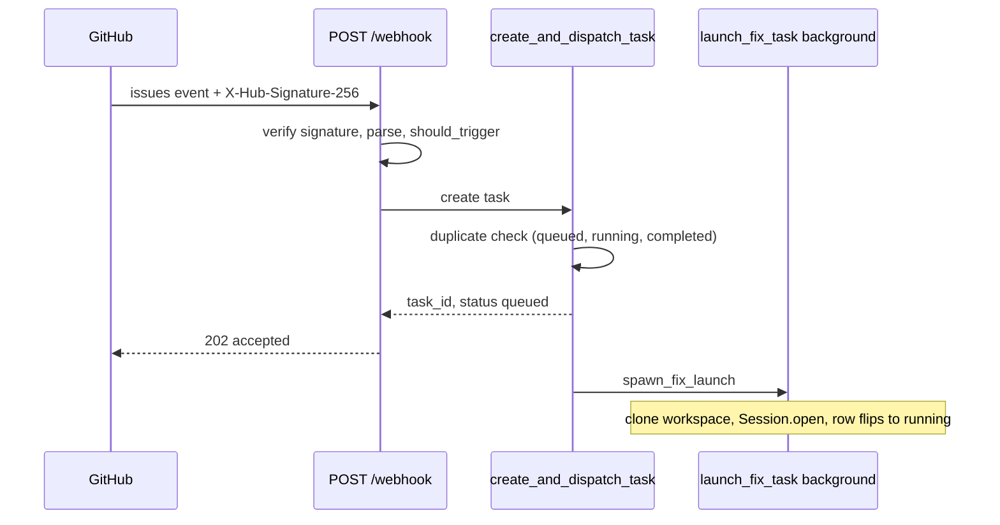

# Webhook and dispatch

Active contributors: jan21deepak

## Purpose

`POST /webhook` in `app/app.py` is the entry point that turns a labeled GitHub issue into a task. It verifies the delivery, applies the trigger rules, and delegates to `create_and_dispatch_task` in `app/tasks.py`, which persists a `Task` row and launches the Droid session in the background so the HTTP response returns in well under GitHub's roughly ten second delivery timeout.

## Directory layout

- `app/app.py`: the `POST /webhook` route and the dashboard assign endpoints.
- `app/tasks.py`: `create_and_dispatch_task` and `TaskCreateError`.
- `app/github.py`: signature verification, payload parsing, trigger rules.
- `app/worker.py`: `spawn_fix_launch`, the background launcher.

## Key abstractions

| Type or function | File | Description |
| --- | --- | --- |
| `webhook` route | `app/app.py` | Read the raw body, check signature and event type, apply trigger rules, dispatch. |
| `verify_signature` | `app/github.py` | HMAC SHA-256 check of `X-Hub-Signature-256`; 401 on mismatch. |
| `parse_issue_event` | `app/github.py` | Extract repository, issue number, title, body, and labels. |
| `should_trigger` | `app/github.py` | True only for `opened` with the label, or `labeled` with the trigger label. |
| `create_and_dispatch_task` | `app/tasks.py` | Duplicate-safe task creation plus background launch. |
| `TaskCreateError` | `app/tasks.py` | Carries a status code and the existing task id for duplicates. |
| `spawn_fix_launch` | `app/worker.py` | Fire `launch_fix_task` as an asyncio task tracked as `launch:task-<id>`. |

## How it works

### Intake

The route reads the raw body (needed for the signature), the `X-Hub-Signature-256` and `X-GitHub-Event` headers, then works through a fixed sequence:

1. A signature mismatch returns 401 `invalid signature`. A missing secret skips verification with a warning log.
2. Undecodable JSON returns 422.
3. `ping` deliveries get `{"detail": "pong"}`; any event type other than `issues` is ignored with a detail message.
4. `parse_issue_event` extracts the fields; a payload without a repository or issue number returns 422.
5. `should_trigger` runs against `TRIGGER_LABEL` (default `Droid-complete`); unmet conditions return 200 `ignored: trigger conditions not met`.
6. `create_and_dispatch_task` runs. A `TaskCreateError` with status 200 returns the duplicate's task id; otherwise the route returns 202.

### Fast-return semantics

The 202 response is the point of the design. GitHub abandons webhook deliveries after roughly ten seconds, and cloning a workspace plus opening a Droid session takes longer than that. So `create_and_dispatch_task` writes the `Task` row with status `queued` and returns immediately; `spawn_fix_launch` fires the launcher as a background asyncio task, and the row flips to `running` with a session id once `launch_fix_task` succeeds. The 202 body carries `task_id`, `session_id` (null at this point), and `status: "queued"`.

### Duplicate protection

Before inserting, `create_and_dispatch_task` looks for an existing `Task` with the same repository and issue number in `queued`, `running`, or `completed`. A hit raises `TaskCreateError` with status code 200, and the webhook returns 200 with the existing task id instead of a 202. This covers re-deliveries and the race between the webhook and the dashboard path. Failed tasks are intentionally not duplicates, so a re-labeled issue can start a fresh run after a failure.

### Unconfigured Droid

When the Droid client is not configured (no Factory API key and no CLI auth), the task row is still created and stays `queued`; no launch happens and the result says so. The dashboard shows the queued row and the health endpoint reports the missing configuration.

### Dashboard assignment

`POST /api/issues/assign` reaches the same place by a different route. It adds the trigger label on GitHub; when `PUBLIC_BASE_URL` is set it waits briefly (eight half-second polls) for the webhook to create the task, and otherwise calls `create_and_dispatch_task` directly. Duplicate protection keeps the two paths from double-launching.

## Integration points

- Webhook installation is handled by `ensure_issues_webhook` in `app/github.py`, run when a repository is registered with `PUBLIC_BASE_URL` set, or via `POST /api/webhooks/sync`; see [GitHub integration](github-integration.md).
- The launcher and the finalization chain continue in [Worker](worker.md), and the session mechanics are in [Droid client](droid-client.md).
- Settings: `TRIGGER_LABEL`, `GITHUB_WEBHOOK_SECRET`, `PUBLIC_BASE_URL`; see [Configuration](../reference/configuration.md).

## Entry points for modification

- Trigger rules: `should_trigger` in `app/github.py`.
- Intake validation and response codes: the ordered checks in the `webhook` route in `app/app.py`.
- Dispatch behavior and duplicate rules: `create_and_dispatch_task` in `app/tasks.py`.

## Key source files

| Path | Purpose |
| --- | --- |
| `app/app.py` | The `POST /webhook` route and dashboard assign endpoints. |
| `app/tasks.py` | Task creation, duplicate protection, background launch. |
| `app/github.py` | Signature verification, event parsing, trigger decision. |
| `app/worker.py` | The background launcher invoked on dispatch. |

## Related pages

- [GitHub integration](github-integration.md) for the client and signature internals.
- [Worker](worker.md) for what the launch leads to.
- [Issue to PR](../features/issue-to-pr.md) for the full workflow.
