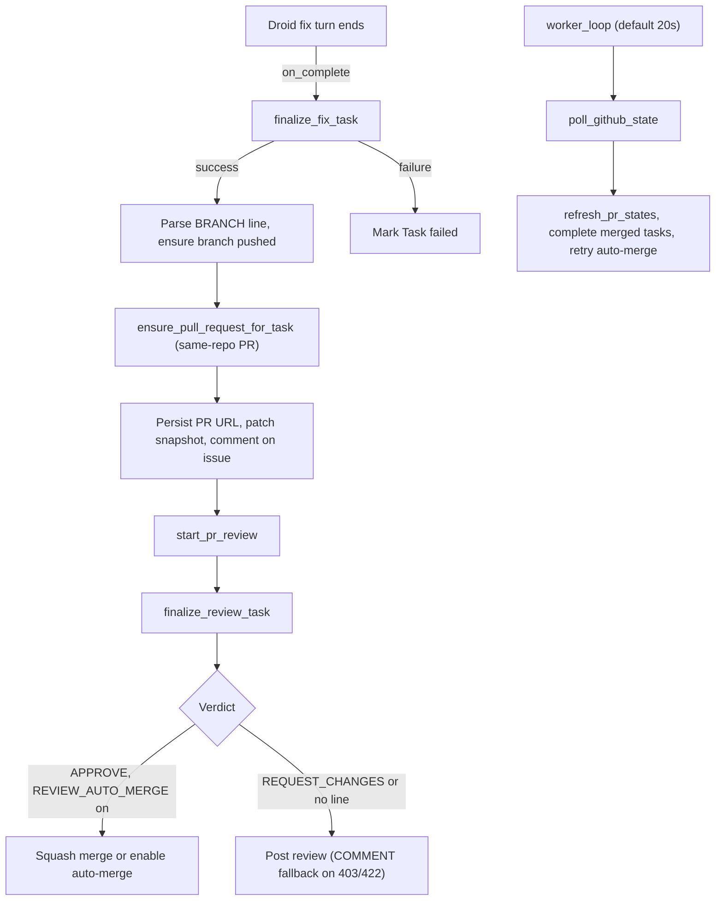

# Worker

Active contributors: jan21deepak

## Purpose

`app/worker.py` owns everything that happens after a Droid turn ends, plus the reconciliation no callback can observe. Finalization is event-driven: `launch_fix_task` and `launch_review_task` start runs and register completion callbacks, and `finalize_fix_task` / `finalize_review_task` persist outcomes, open pull requests, post comments and reviews, and optionally merge. The worker loop only reconciles GitHub-side state (PR open, closed, merged, and auto-merge) every `POLL_INTERVAL_SECONDS`.

## Directory layout

One module, `app/worker.py`, over the client in `app/droid_client.py`, the GitHub client in `app/github.py`, and the rows in `app/models.py`.

## Key abstractions

| Function | File | Description |
| --- | --- | --- |
| `launch_fix_task`, `spawn_fix_launch` | `app/worker.py` | Background fix launcher, tracked as `launch:task-<id>`. |
| `finalize_fix_task` | `app/worker.py` | Turn callback for fix, follow-up, and recovery runs. |
| `ensure_pull_request_for_task` | `app/worker.py` | Open or reuse a same-repo PR for the agent branch. |
| `build_completion_comment` | `app/worker.py` | Render the issue comment: session, PR, runtime, summary. |
| `ensure_review_task_row`, `start_pr_review` | `app/worker.py` | Deduped `ReviewTask` creation, non-blocking review launch. |
| `launch_review_task`, `finalize_review_task` | `app/worker.py` | Review launcher and turn callback; posts the GitHub review. |
| `_attempt_auto_merge` | `app/worker.py` | Squash merge after approval, else enable GitHub auto-merge. |
| `refresh_pr_states`, `finalize_merged_running_tasks` | `app/worker.py` | Sync PR state, complete merged-but-active rows. |
| `poll_github_state`, `worker_loop` | `app/worker.py` | One reconciliation pass and the loop that schedules it. |
| `recover_interrupted_tasks` | `app/worker.py` | Startup recovery for rows orphaned by a restart. |

## How it works

### Fix finalization

`launch_fix_task` starts the run and, on success, stores the session id and sets the row to `running`; a launch failure marks it `failed` with the error. `finalize_fix_task` then maps the outcome to a status and persists summary, duration, credits, tokens, flat cost (`DROID_USD_PER_AGENT_RUN` on success), error text, and `completed_at`. On success it parses the `BRANCH:` line (falling back to the workspace HEAD), calls `ensure_branch_pushed`, and opens the PR. Two ordering details are fixes from a real run: the PR URL is persisted immediately through `_persist_task_pr_url` so a crash cannot lose the link, and a freshly created URL is patched onto the detached `Task` snapshot before the completion comment renders.

### Same-repo pull requests

`ensure_pull_request_for_task` first reuses an existing open PR with the same head. Otherwise it creates the PR inside `task.repository` with `head=owner:branch` (normalized by `GitHubClient.create_pull_request` with `same_repo=True`) and base from the repo's `starting_ref` or the default branch. The title carries the issue number, the body carries `Fixes #<issue>` plus the session id. A 422 from a create race falls back to re-finding the open PR.

### Completion comment and review

`build_completion_comment` renders session id, PR URL, runtime, Singapore-time completion stamp, and agent summary; `finalize_fix_task` posts it to the issue, then calls `start_pr_review`. `ensure_review_task_row` allows one active review per repository and PR number. `finalize_review_task` maps the parsed `VERDICT:` line to APPROVE, REQUEST_CHANGES, or COMMENT (no verdict line), truncates the body to 60,000 characters, and posts it through `create_pull_request_review`. GitHub rejects APPROVE and REQUEST_CHANGES on PRs authored by the token owner, so a 403 or 422 retries with COMMENT.

### Auto-merge

When `REVIEW_AUTO_MERGE` is true (default false) and the posted verdict is APPROVE, `_attempt_auto_merge` squash-merges with commit title `<pr_title> (#<pr_number>)`. On 405, 409, or 422 (merge blocked, checks pending) it enables GitHub auto-merge instead. The `merged` and `auto_merge_enabled` flags land on the `ReviewTask` row.

### Polling

`poll_github_state`, driven by `worker_loop` every `POLL_INTERVAL_SECONDS` (default 20), refreshes `pr_state` for every task with a PR URL, completes active tasks whose PR is already merged, then walks completed reviews that are not merged: detect merges, or retry auto-merge for open PRs. The loop never polls the Droid runtime; turns report completion through callbacks.

### Restart recovery

`recover_interrupted_tasks` runs once at startup from the lifespan in `app/app.py`. Active rows (queued or running) whose session is not streaming are resumed with the recovery prompt and re-registered with their finalizer. Rows that never got a session id are failed with "dispatch interrupted by service restart"; a resume failure marks the row failed with the error.

## Integration points

- `app/tasks.py` calls `spawn_fix_launch` at dispatch time; see [Webhook and dispatch](webhook-and-dispatch.md).
- All GitHub interaction goes through `GitHubClient` in `app/github.py`; see [GitHub integration](github-integration.md).
- Rows and statuses live in `app/models.py`; see [Persistence](persistence.md).
- Follow-up dispatch (`POST /api/tasks/{task_id}/follow-up` in `app/app.py`) reuses `finalize_fix_task` as its `on_complete`.

## Entry points for modification

- Post-turn behavior: `finalize_fix_task` and `finalize_review_task`.
- PR title, body, or base selection: `ensure_pull_request_for_task`.
- Merge policy: `_attempt_auto_merge` and the `REVIEW_AUTO_MERGE` setting in `app/config.py`.
- Reconciliation scope: `poll_github_state` and `refresh_pr_states`.

## Key source files

| Path | Purpose |
| --- | --- |
| `app/worker.py` | Launchers, finalizers, polling, recovery. |
| `app/droid_client.py` | Outcomes, branch helpers, session resumes. |
| `app/github.py` | PR create, comments, reviews, merge, auto-merge. |
| `app/models.py` | `Task`, `ReviewTask`, `TaskStatus`. |

## Related pages

- [Droid client](droid-client.md) for the runs the worker finalizes.
- [GitHub integration](github-integration.md) for the API calls involved.
- [Patterns and conventions](../how-to-contribute/patterns-and-conventions.md) for the async and error-handling rules used here.
